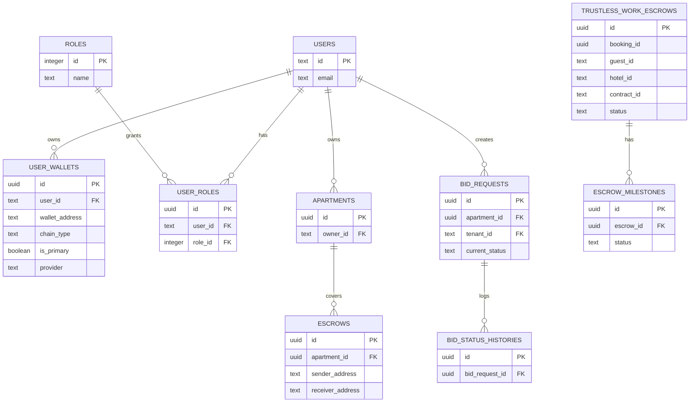

# Data model and multi-tenant Postgres / Hasura layer

This document is based on the actual SQL migrations under `infra/hasura/migrations` and the Hasura metadata under `infra/hasura/metadata/tenants`. It reflects the repository’s real schema, not an inferred generic rental model.

## 1) Tenant structure

The project keeps separate Postgres schemas/tenant data sets for two product domains:

- `safetrust` tenant: apartment marketplace / landlord-tenant escrow model
- `hotel_industry` tenant: hotel booking / reservation / transaction model

The safetrust tenant is the one with explicit Hasura metadata (`infra/hasura/metadata/tenants/safetrust/...`), which exposes tables as GraphQL objects and object relationships. The hotel_industry migrations exist as SQL under `infra/hasura/migrations/hotel_industry`, but the checked-in tenant metadata does not yet include full table metadata for that tenant.

## 2) safetrust schema

### Core identity and role model

#### `public.users`
Created by `1731908676359_create_users/up.sql`.

```sql
CREATE TABLE public.users (
    id TEXT PRIMARY KEY,
    email TEXT NOT NULL,
    first_name TEXT,
    last_name TEXT,
    phone_number TEXT,
    country_code TEXT,
    location TEXT,
    last_seen TIMESTAMP WITH TIME ZONE DEFAULT NOW(),
    CONSTRAINT users_email_unique UNIQUE (email)
);
```

- `id` is the Firebase UID, not a generated UUID.
- One row per authenticated app user.
- `email` is unique and treated as the canonical login identity.

#### `public.roles`
Created by `1786000000000_create_user_roles/up.sql`.

```sql
CREATE TABLE public.roles (
    id SERIAL PRIMARY KEY,
    name TEXT NOT NULL,
    description TEXT,
    created_at TIMESTAMP WITH TIME ZONE NOT NULL DEFAULT NOW(),
    CONSTRAINT roles_name_key UNIQUE (name)
);
```

Seed values:

```sql
INSERT INTO public.roles (name, description) VALUES
    ('guest', 'Default role: can browse and book apartments'),
    ('host', 'Can list apartments and manage escrows as receiver'),
    ('admin', 'Platform administrator');
```

Because this is `SERIAL`, the effective IDs are:

- `guest = 1`
- `host = 2`
- `admin = 3`

#### `public.user_roles`
Join table created in the same migration.

```sql
CREATE TABLE public.user_roles (
    id UUID PRIMARY KEY DEFAULT uuid_generate_v4(),
    user_id TEXT NOT NULL REFERENCES public.users(id) ON DELETE CASCADE,
    role_id INTEGER NOT NULL REFERENCES public.roles(id) ON DELETE CASCADE,
    created_at TIMESTAMP WITH TIME ZONE NOT NULL DEFAULT NOW(),
    CONSTRAINT user_roles_user_id_role_id_key UNIQUE (user_id, role_id)
);
```

- A user can hold multiple roles concurrently.
- The application intentionally avoids trusting row order; it resolves the highest privilege in code instead.

### Wallets and apartments

#### `public.user_wallets`
Created by `1731909024829_create_user_wallets/up.sql`, later extended by `1778300000001_add_provider_to_user_wallets/up.sql`.

```sql
CREATE TABLE public.user_wallets (
    id UUID PRIMARY KEY DEFAULT uuid_generate_v4(),
    user_id TEXT NOT NULL REFERENCES public.users(id) ON DELETE CASCADE,
    wallet_address TEXT NOT NULL,
    chain_type TEXT NOT NULL,
    is_primary BOOLEAN DEFAULT false,
    created_at TIMESTAMP WITH TIME ZONE DEFAULT NOW(),
    updated_at TIMESTAMP WITH TIME ZONE DEFAULT NOW(),
    CONSTRAINT unique_wallet_address UNIQUE (wallet_address),
    CONSTRAINT valid_chain_type CHECK (chain_type IN ('STELLAR'))
);
```

Then:

```sql
ALTER TABLE public.user_wallets
  ADD COLUMN provider TEXT NOT NULL DEFAULT 'external';

ALTER TABLE public.user_wallets
  ADD CONSTRAINT valid_wallet_provider
  CHECK (provider IN ('external', 'pollar', 'freighter'));
```

The wallet model stores a user’s external wallet addresses, the chain family (`STELLAR`), whether it is the primary wallet (`is_primary`), and which provider it came from. The real providers used in this repo are `freighter` and `pollar`; `external` is the default legacy value.

#### `public.apartments`
Created by `1732588166945_create_apartments/up.sql`.

```sql
CREATE TABLE public.apartments (
    id UUID PRIMARY KEY DEFAULT uuid_generate_v4(),
    owner_id TEXT NOT NULL REFERENCES public.users(id) ON DELETE CASCADE,
    name TEXT NOT NULL,
    description TEXT,
    price DECIMAL(10,2) NOT NULL CHECK (price > 0),
    warranty_deposit DECIMAL(10,2) NOT NULL CHECK (warranty_deposit > 0),
    coordinates POINT NOT NULL,
    location_area GEOMETRY(POLYGON, 4326),
    address JSONB NOT NULL,
    is_available BOOLEAN DEFAULT true,
    available_from TIMESTAMP WITH TIME ZONE NOT NULL,
    available_until TIMESTAMP WITH TIME ZONE,
    created_at TIMESTAMP WITH TIME ZONE DEFAULT NOW(),
    updated_at TIMESTAMP WITH TIME ZONE DEFAULT NOW(),
    deleted_at TIMESTAMP WITH TIME ZONE,
    CONSTRAINT valid_date_range
        CHECK (available_until IS NULL OR available_from < available_until)
);
```

- `owner_id` links property ownership to a user.
- `coordinates` uses PostGIS `POINT` and `location_area` uses a PostGIS polygon.
- `address` is stored as JSONB, which allows flexible property-address payloads.
- `image_urls` is later added as a `TEXT[]` column.

### Escrow tables

#### `public.escrows`
Created by `1771690624593_create_escrows_table/up.sql`.

This table is the single-release escrow used for security deposits.

```sql
CREATE TABLE public.escrows (
    id UUID PRIMARY KEY DEFAULT uuid_generate_v4(),
    contract_id TEXT NOT NULL,
    engagement_id TEXT NOT NULL,
    property_id TEXT NOT NULL,
    sender_address TEXT NOT NULL,
    receiver_address TEXT NOT NULL,
    amount NUMERIC(20, 7) NOT NULL CHECK (amount > 0),
    status TEXT NOT NULL DEFAULT 'pending_signature',
    unsigned_xdr TEXT,
    created_at TIMESTAMP WITH TIME ZONE NOT NULL DEFAULT NOW(),
    updated_at TIMESTAMP WITH TIME ZONE NOT NULL DEFAULT NOW(),
    tenant_id VARCHAR(255) NOT NULL DEFAULT 'safetrust',
    apartment_id UUID REFERENCES public.apartments(id) ON DELETE SET NULL,
    CONSTRAINT valid_escrow_status CHECK (status IN (
        'deploying', 'pending_signature', 'funded', 'completed',
        'disputed', 'resolved', 'cancelled'
    ))
);
```

- `contract_id` and `engagement_id` are the blockchain / TrustlessWork identifiers.
- `sender_address` and `receiver_address` are wallet addresses.
- `type` is not a separate enum; status is a constrained string.

#### `public.trustless_work_escrows`
Created by `1731909059420_create_trustless_work_escrows/up.sql`.

This is the more detailed Trustless Work escrow ledger used in the booking flow.

```sql
CREATE TABLE public.trustless_work_escrows (
    id UUID PRIMARY KEY DEFAULT gen_random_uuid(),
    contract_id VARCHAR(255) UNIQUE NOT NULL,
    marker VARCHAR(255) NOT NULL,
    approver VARCHAR(255) NOT NULL,
    releaser VARCHAR(255) NOT NULL,
    resolver VARCHAR(255),
    escrow_type VARCHAR(50) NOT NULL CHECK (escrow_type IN ('single_release', 'multi_release')),
    status VARCHAR(50) NOT NULL,
    asset_code VARCHAR(10) NOT NULL DEFAULT 'USDC',
    asset_issuer VARCHAR(255),
    amount DECIMAL(20, 7) NOT NULL,
    balance DECIMAL(20, 7) DEFAULT 0,
    booking_id VARCHAR(255),
    room_id VARCHAR(255),
    hotel_id VARCHAR(255),
    guest_id VARCHAR(255),
    check_in_date TIMESTAMP WITH TIME ZONE,
    check_out_date TIMESTAMP WITH TIME ZONE,
    booking_created_at TIMESTAMP WITH TIME ZONE,
    escrow_metadata JSONB,
    booking_metadata JSONB,
    created_at TIMESTAMP WITH TIME ZONE DEFAULT NOW(),
    updated_at TIMESTAMP WITH TIME ZONE DEFAULT NOW(),
    tenant_id VARCHAR(255) NOT NULL DEFAULT 'safetrust',
    CONSTRAINT valid_escrow_status CHECK (status IN (
        'created', 'pending_funding', 'funded', 'active',
        'milestone_approved', 'completed', 'disputed', 'resolved', 'cancelled'
    ))
);
```

This table is effectively the DB mirror of the Trustless Work contract lifecycle. `status` is not a local business state invented by the app; it tracks the on-chain / API escrow state. The app expects statuses like `created`, `pending_funding`, `funded`, `active`, `milestone_approved`, `completed`, `disputed`, `resolved`, and `cancelled`.

#### `public.escrow_milestones`
Created by `1731909059421_create_escrow_milestones/up.sql`.

```sql
CREATE TABLE public.escrow_milestones (
  id UUID PRIMARY KEY DEFAULT gen_random_uuid(),
  escrow_id UUID NOT NULL REFERENCES public.trustless_work_escrows(id) ON DELETE CASCADE,
  milestone_id VARCHAR(255) NOT NULL,
  description TEXT NOT NULL,
  amount DECIMAL(20, 7) NOT NULL,
  due_date TIMESTAMP WITH TIME ZONE,
  status VARCHAR(50) NOT NULL DEFAULT 'pending',
  approved_at TIMESTAMP WITH TIME ZONE,
  approved_by VARCHAR(255),
  released_at TIMESTAMP WITH TIME ZONE,
  released_by VARCHAR(255),
  metadata JSONB,
  created_at TIMESTAMP WITH TIME ZONE DEFAULT NOW(),
  updated_at TIMESTAMP WITH TIME ZONE DEFAULT NOW(),
  tenant_id VARCHAR(255) NOT NULL DEFAULT 'safetrust',
  CONSTRAINT valid_milestone_status CHECK (status IN (
    'pending', 'approved', 'disputed', 'released', 'cancelled'
  )),
  CONSTRAINT unique_escrow_milestone UNIQUE(escrow_id, milestone_id)
);
```

This is the multi-release milestone payment layer for the Trustless Work escrow flow.

### Bid workflow tables

#### `public.bid_requests`
Created by `1732865994413_create_bid_tables/up.sql`.

```sql
CREATE TABLE public.bid_requests (
    id UUID PRIMARY KEY DEFAULT uuid_generate_v4(),
    apartment_id UUID NOT NULL REFERENCES public.apartments(id) ON DELETE CASCADE,
    tenant_id TEXT NOT NULL REFERENCES public.users(id) ON DELETE CASCADE,
    current_status TEXT NOT NULL DEFAULT 'PENDING',
    proposed_price DECIMAL(10,2) NOT NULL CHECK (proposed_price > 0),
    desired_move_in TIMESTAMP WITH TIME ZONE NOT NULL,
    created_at TIMESTAMP WITH TIME ZONE DEFAULT NOW(),
    updated_at TIMESTAMP WITH TIME ZONE DEFAULT NOW(),
    deleted_at TIMESTAMP WITH TIME ZONE,
    CONSTRAINT valid_status CHECK (
        current_status IN (
            'PENDING', 'VIEWED', 'APPROVED', 'CONFIRMED',
            'ESCROW_FUNDED', 'ESCROW_COMPLETED', 'CANCELLED'
        )
    )
);
```

- One active bid per tenant is enforced by a partial unique index on `tenant_id` when the bid is still active.
- Status events are recorded in `bid_status_histories`.

#### `public.bid_status_histories`
Also in the same migration.

```sql
CREATE TABLE public.bid_status_histories (
    id UUID PRIMARY KEY DEFAULT uuid_generate_v4(),
    bid_request_id UUID REFERENCES public.bid_requests(id) ON DELETE CASCADE,
    status TEXT NOT NULL,
    notes TEXT,
    changed_by TEXT REFERENCES public.users(id) ON DELETE SET NULL,
    created_at TIMESTAMP WITH TIME ZONE DEFAULT NOW()
);
```

A trigger writes an audit row whenever `bid_requests.current_status` changes or a bid is inserted.

## 3) Hotel industry schema

This tenant is centered on hotel inventory, reservations, and booking escrow transactions.

### Inventory and bookings

#### `hotels`
Created by `1723171122097_create_hotels_table/up.sql`.

```sql
CREATE TABLE IF NOT EXISTS hotels (
    id UUID PRIMARY KEY DEFAULT uuid_generate_v4(),
    name VARCHAR(20) NOT NULL,
    description VARCHAR(50),
    address VARCHAR(50) NOT NULL,
    location_area VARCHAR(20),
    coordinates geometry(Point, 4326),
    created_at TIMESTAMP WITH TIME ZONE DEFAULT NOW(),
    updated_at TIMESTAMP WITH TIME ZONE DEFAULT NOW()
);
```

#### `room_types`
Created by `1733171122097_create_room_types/up.sql`.

```sql
CREATE TABLE room_types (
    id UUID PRIMARY KEY DEFAULT uuid_generate_v4(),
    name VARCHAR(25) NOT NULL,
    description TEXT,
    created_at TIMESTAMP WITH TIME ZONE DEFAULT NOW(),
    updated_at TIMESTAMP WITH TIME ZONE DEFAULT NOW(),
    UNIQUE(name)
);
```

#### `rooms`
Created by `1733171122099_create_rooms/up.sql`.

```sql
CREATE TABLE IF NOT EXISTS rooms (
    room_id UUID PRIMARY KEY DEFAULT uuid_generate_v4(),
    hotel_id UUID NOT NULL REFERENCES hotels(id) ON DELETE CASCADE,
    room_number VARCHAR(5) NOT NULL,
    room_type_id UUID NOT NULL REFERENCES room_types(id) ON DELETE RESTRICT,
    price_night DECIMAL(10,2) NOT NULL CHECK (price_night > 0),
    capacity INTEGER NOT NULL,
    status BOOLEAN,
    created_at TIMESTAMP WITH TIME ZONE DEFAULT NOW(),
    updated_at TIMESTAMP WITH TIME ZONE DEFAULT NOW(),
    UNIQUE(hotel_id, room_number)
);
```

#### `reservations`
Created by `1745664202191_create_reservations/up.sql`.

```sql
CREATE TABLE reservations (
    id UUID PRIMARY KEY DEFAULT uuid_generate_v4(),
    reservation_id UUID,
    wallet_address VARCHAR(255),
    room_id UUID REFERENCES rooms(room_id),
    check_in TIMESTAMPTZ,
    check_out TIMESTAMPTZ,
    capacity INTEGER,
    reservation_status VARCHAR(15) DEFAULT 'PENDING',
    total_amount NUMERIC(10, 2),
    created_at TIMESTAMPTZ DEFAULT NOW(),
    updated_at TIMESTAMPTZ DEFAULT NOW()
);
```

- `reservation_status` is a simple string enum-like workflow (`PENDING` by default).
- `reservation_id` appears to be a separate ID field; the actual relation is `room_id -> rooms(room_id)`.

#### `room_images`
Created by `1746439500253_create-room-images/up.sql`.

```sql
CREATE TABLE room_images (
    id UUID PRIMARY KEY DEFAULT uuid_generate_v4(),
    room_id UUID REFERENCES rooms(room_id),
    image_url VARCHAR(150),
    uploaded_at TIMESTAMPTZ DEFAULT NOW()
);
```

#### `pricing_rules`
Created by `1756285113000_create_pricing_rules/up.sql`.

```sql
CREATE TABLE hotel_industry.pricing_rules (
    id UUID PRIMARY KEY DEFAULT gen_random_uuid(),
    rule_name VARCHAR(100) NOT NULL,
    rule_type VARCHAR(50) NOT NULL,
    currency VARCHAR(10) NOT NULL,
    base_amount DECIMAL(20,7) DEFAULT 0,
    percentage DECIMAL(5,4) DEFAULT 0,
    min_amount DECIMAL(20,7) DEFAULT 0,
    max_amount DECIMAL(20,7) DEFAULT 999999999,
    room_type VARCHAR(50),
    season VARCHAR(30),
    advance_booking_days INTEGER,
    priority INTEGER DEFAULT 100,
    is_active BOOLEAN DEFAULT true,
    created_at TIMESTAMPTZ DEFAULT NOW(),
    updated_at TIMESTAMPTZ DEFAULT NOW(),
    CONSTRAINT unique_hotel_rule_type_currency UNIQUE (rule_type, currency, room_type, season)
);
```

### User and escrow transaction tables

#### `public.users` (hotel_industry)
Created by `1723171122098_create_hotel_users/up.sql`.

```sql
CREATE TABLE IF NOT EXISTS public.users (
    id UUID PRIMARY KEY DEFAULT uuid_generate_v4(),
    firebase_uid TEXT,
    email VARCHAR(150) NOT NULL,
    first_name VARCHAR(50),
    last_name VARCHAR(50),
    phone_number VARCHAR(15),
    role VARCHAR(20) NOT NULL DEFAULT 'GUEST',
    created_at TIMESTAMP WITH TIME ZONE NOT NULL DEFAULT NOW(),
    updated_at TIMESTAMP WITH TIME ZONE NOT NULL DEFAULT NOW(),
    CONSTRAINT valid_user_role CHECK (role IN ('GUEST', 'STAFF', 'MANAGER'))
);
```

#### `users_wallets`
Created by `1743029389869_create_users_wallets_table/up.sql`.

- `user_id` points to hotel user records.
- `wallet_address` is unique.
- `chain_type` is a string, not a constrained enum in this migration.
- `is_primary` identifies the preferred wallet.

#### `escrow_transactions`
Created by `1745664202192_create_escrow_transactions/up.sql`.

```sql
CREATE TABLE escrow_transactions (
    id UUID PRIMARY KEY DEFAULT uuid_generate_v4(),
    reservation_id UUID,
    contract_id TEXT UNIQUE,
    escrow_status VARCHAR(200) DEFAULT 'PENDING',
    signer_address VARCHAR(200),
    transaction_type VARCHAR(150),
    escrow_transaction_type VARCHAR(150),
    http_status_code INTEGER,
    created_at TIMESTAMP WITH TIME ZONE DEFAULT NOW(),
    updated_at TIMESTAMP WITH TIME ZONE DEFAULT NOW()
);
```

- This is the hotel reservation escrow transaction log.
- `reservation_id` is linked to `reservations(id)`.
- `escrow_payload` and `fund_payload` are added later as JSONB to store API payloads.

#### `escrow_transaction_users`
Created by `1745664202193_create_escrow_transaction_users/up.sql`.

```sql
CREATE TABLE escrow_transaction_users (
    id UUID PRIMARY KEY DEFAULT uuid_generate_v4(),
    user_email VARCHAR(150) REFERENCES users(email),
    escrow_transaction_id UUID REFERENCES escrow_transactions(id),
    role VARCHAR(20),
    status VARCHAR(20),
    is_primary BOOLEAN DEFAULT false,
    created_at TIMESTAMPTZ DEFAULT NOW(),
    updated_at TIMESTAMPTZ DEFAULT NOW(),
    CONSTRAINT unique_escrow_user_role UNIQUE (escrow_transaction_id, user_email, role)
);
```

This table tracks which users were involved in an escrow transaction and their funding status per user.

## 4) Relationship diagram



Hotel_industry relationships are parallel but simpler:

- `hotels` -> `rooms` -> `room_images`
- `room_types` -> `rooms`
- `rooms` -> `reservations`
- `reservations` -> `escrow_transactions`
- `escrow_transactions` -> `escrow_transaction_users`

## 5) Role system and middleware resolution

The role catalog is defined as `public.roles` and seeded as:

- `guest`
- `host`
- `admin`

The join table `public.user_roles` allows a user to hold multiple roles at once. The app resolves the highest-privilege role instead of trusting the first row returned by Hasura.

The middleware logic is in `apps/frontend/src/lib/middleware/roles.ts`:

```ts
const ROLE_PRECEDENCE: readonly UserRole[] = ['guest', 'host', 'admin'];

export function resolveHighestRole(names: readonly (string | undefined)[]): UserRole {
  let resolved: UserRole = DEFAULT_ROLE;

  for (const name of names) {
    if (!isUserRole(name)) continue;
    if (ROLE_PRECEDENCE.indexOf(name) > ROLE_PRECEDENCE.indexOf(resolved)) {
      resolved = name;
    }
  }

  return resolved;
}
```

This means a user with both `guest` and `host` roles resolves to `host`, and a user with `admin` resolves to `admin` regardless of row order. The `public.user_roles` metadata in Hasura exposes `role` and `user` object relationships, which are used by the frontend to fetch and resolve the effective role.

## 6) Hasura GraphQL exposure

The safetrust tenant metadata defines GraphQL object relationships and per-role permission sets. Examples from `infra/hasura/metadata/tenants/safetrust/...`:

- `public_users.yaml` exposes `users` with object relationships and tenant-scoped permissions.
- `public_user_roles.yaml` defines `user` and `role` object relationships on `user_roles`.
- `public_apartments.yaml` defines an `owner` relationship from `apartments` to `users`.
- `public_escrows.yaml` defines relationships from `escrows` to `apartments` and wallet-based access rules.

The GraphQL model therefore mirrors the SQL design:

- `users` -> `user_wallets`
- `users` -> `user_roles` -> `roles`
- `users` -> `apartments`
- `apartments` -> `escrows`
- `apartments` -> `bid_requests`
- `bid_requests` -> `bid_status_histories`
- `trustless_work_escrows` -> `escrow_milestones`

## 7) Data-layer summary

The core pattern in this repository is:

1. Postgres tables store canonical state.
2. Hasura exposes those tables as GraphQL objects and relationships.
3. The frontend reads only the relevant objects for the active tenant.
4. State transitions (escrow lifecycle, bid workflow) are persisted in the database and often audited with trigger-created history tables.

The resulting model is intentionally multi-tenant: the same app can host separate data sets with different SQL table layouts while using the same Hasura patterns for access control and querying.
