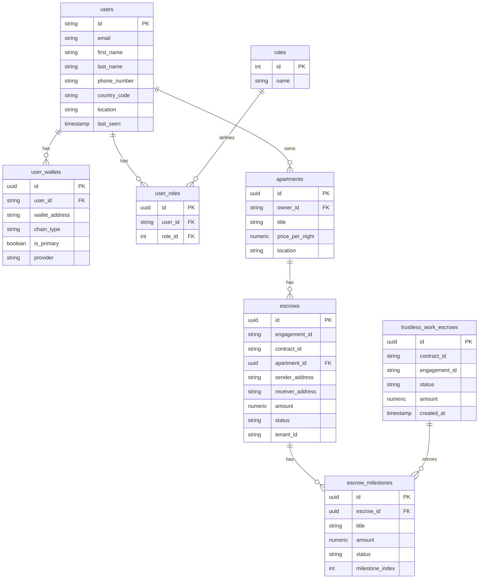
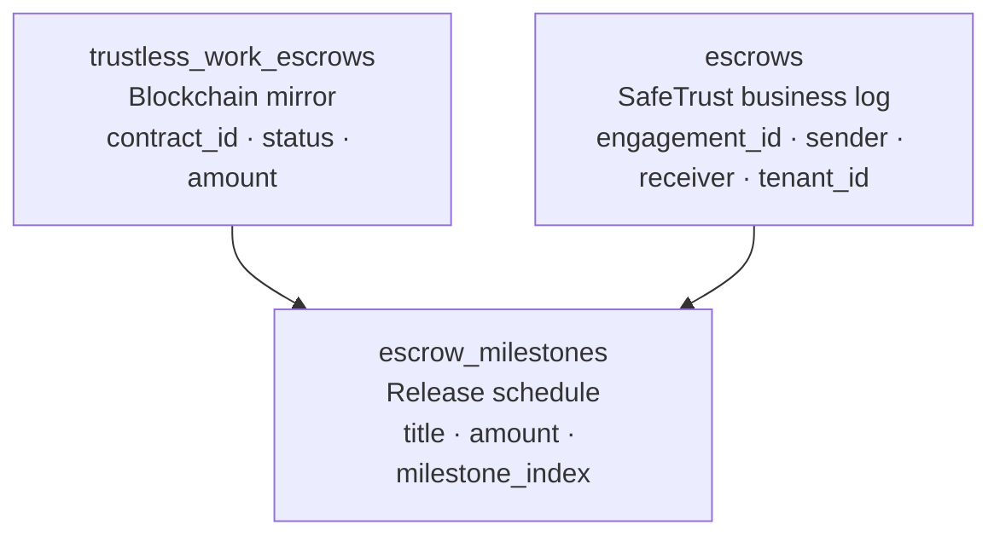

# Data Model

SafeTrust uses PostgreSQL with two schemas managed by Hasura: `safetrust`
(core platform) and `hotel_industry` (hospitality vertical).

## Core entity relationships

## Three-layer escrow hierarchy

Every escrow write follows this hierarchy:
1. `trustless_work_escrows` — mirrors the on-chain Soroban contract state
2. `escrow_milestones` — defines the release schedule and tracks per-milestone status
3. `escrows` — SafeTrust business context (who, what property, which tenant)

## Key constraints

| Table | Constraint | Purpose |
|---|---|---|
| `escrows` | `UNIQUE(engagement_id)` | Idempotency guard — prevents double-deploy |
| `user_roles` | `UNIQUE(user_id, role_id)` | Idempotent promote-to-host |
| `user_wallets` | `UNIQUE(wallet_address)` | One wallet entry per address |
| `users` | `UNIQUE(email)` | Firebase UID upsert anchor |

## Roles

The `roles` table is seeded with three entries:

| id | name |
|---|---|
| 1 | guest |
| 2 | host |
| 3 | admin |

Roles are assigned via `user_roles`. A user may hold multiple roles —
the middleware resolves the highest privilege: `admin > host > guest`.