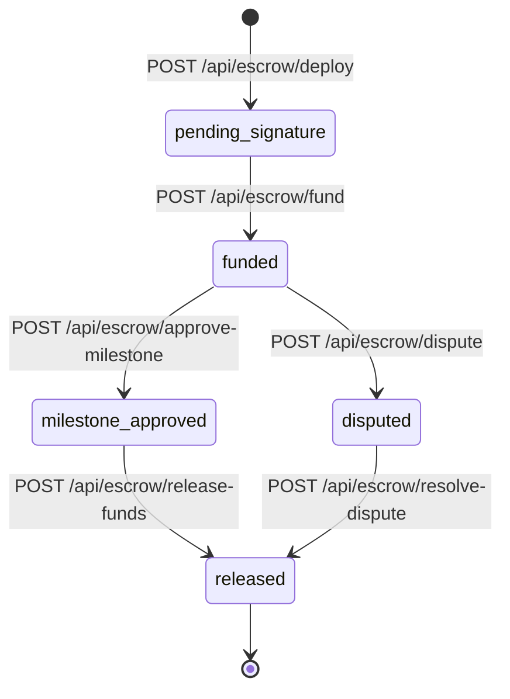
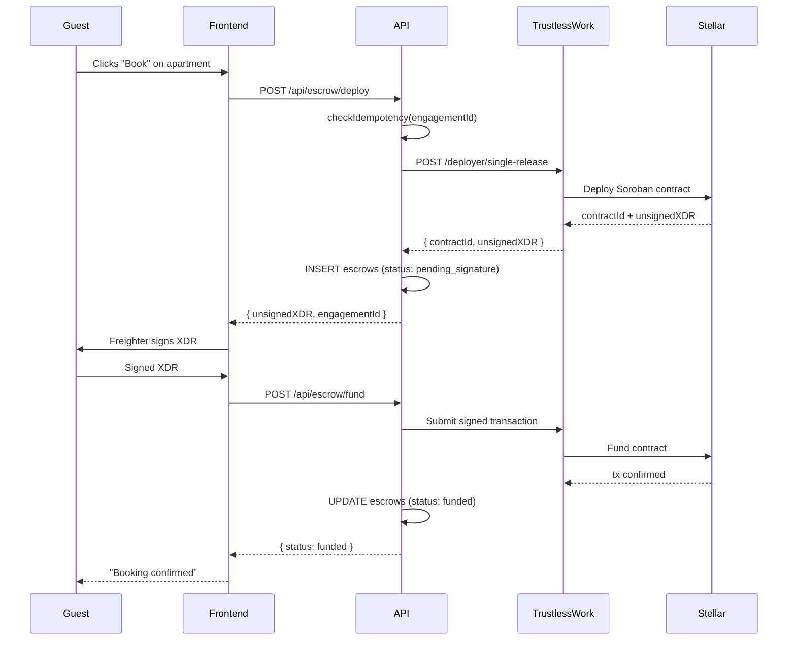

# Escrow Lifecycle

A SafeTrust escrow moves through six states from creation to fund release.
All state transitions are initiated via `apps/api` and mirrored to the
Stellar blockchain through TrustlessWork.

## State machine

## Step-by-step flow

## Idempotency

Every deploy request is guarded by `checkIdempotency(engagementId)` before
reaching TrustlessWork. Through the `safetrust` Hasura source, the guard queries
the `engagement_id` column on `public.escrows` (`public` is the PostgreSQL
schema) and short-circuits with `{ cached: true }` if a row already exists.
This prevents double-click PAY from creating two on-chain escrows before the DB
constraint can fire.

## Roles in escrow contract

| Role | Assigned to | Responsibility |
|---|---|---|
| `approver` | Guest (senderAddress) | Signs milestone approval |
| `serviceProvider` | Host (receiverAddress) | Delivers the service |
| `receiver` | Host (receiverAddress) | Receives funds on release |
| `releaseSigner` | Guest (senderAddress) | Authorizes fund release |
| `disputeResolver` | SafeTrust platform | Resolves disputes |
| `platformAddress` | SafeTrust treasury | Receives platform fee |
