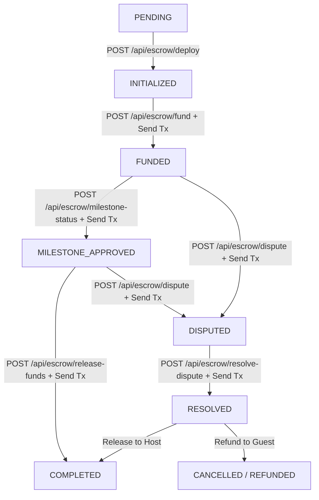
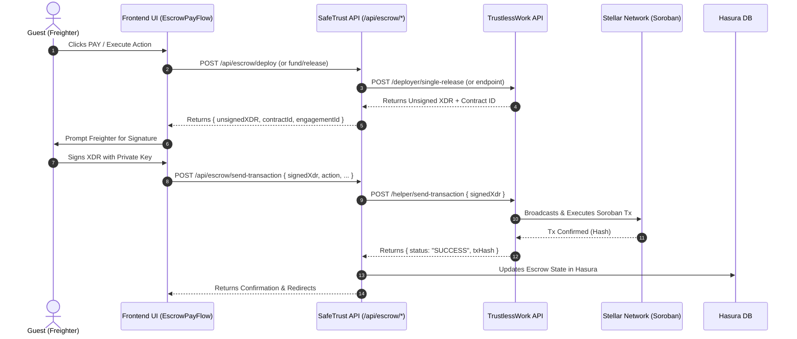
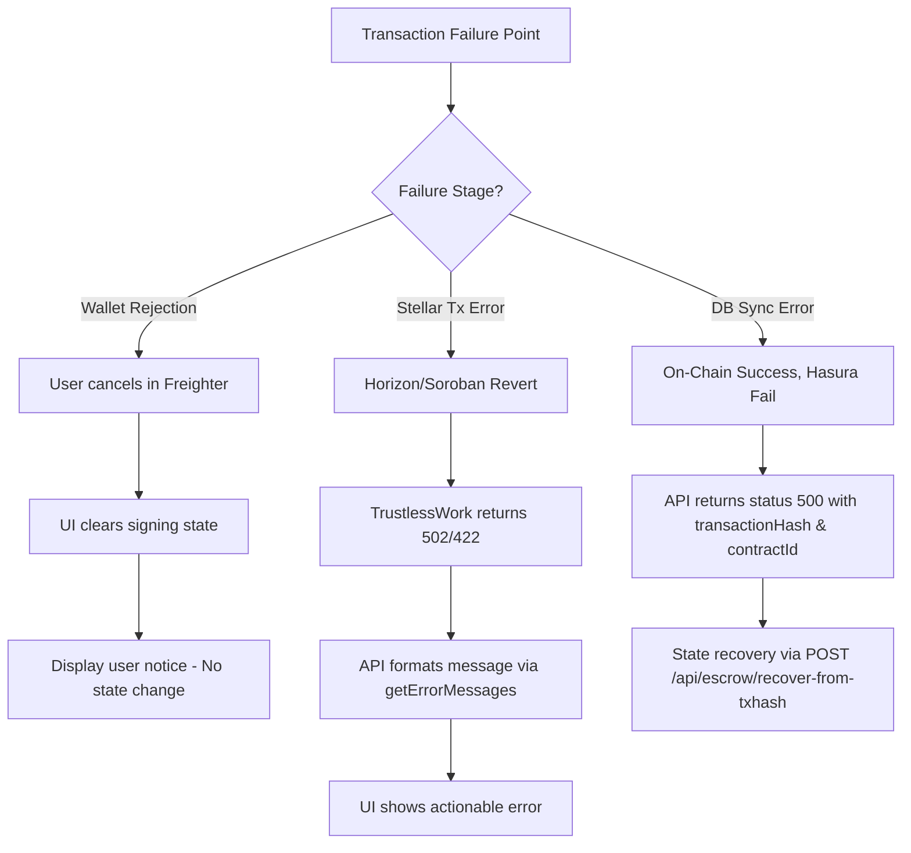

# Escrow Lifecycle & State Machine Architecture

This document describes the complete escrow lifecycle for SafeTrust, detailing every state, state transition, Stellar transaction sequence, signing responsibilities, idempotency controls, and error handling mechanisms. SafeTrust leverages Soroban smart contracts deployed via TrustlessWork to secure apartment rental deposits and payments on the Stellar network.

---

## 1. Escrow State Machine

The SafeTrust escrow lifecycle governs the state transitions of a rental security deposit or payment from initial deployment to final fund release or dispute settlement.

### State Transition Diagram



### State Definitions

| State | Description | On-Chain Status | Primary Actor |
| --- | --- | --- | --- |
| `PENDING` | Escrow deployment initiated by guest prior to on-chain contract creation. | Non-existent | Guest / Server |
| `INITIALIZED` | Soroban smart contract created on Stellar via TrustlessWork deployer. | `initialized` | Server / Guest |
| `FUNDED` | Guest deposits USDC collateral into the Soroban escrow contract address. | `funded` | Guest (Freighter) |
| `MILESTONE_APPROVED` | Host marks stay or rental milestone as fulfilled. | `milestone_approved` | Host (Freighter) |
| `COMPLETED` | Funds are released from escrow contract to host wallet address. | `completed` | Guest / Platform |
| `DISPUTED` | Either guest or host locks escrow balance pending dispute resolution. | `disputed` | Guest / Host |
| `RESOLVED` | Dispute resolver settles funds (releasing to host or refunding guest). | `resolved` | Platform Resolver |

---

## 2. Transaction Sequence Table

Every state transition corresponds to an interaction with the SafeTrust API and a resulting Stellar transaction built via TrustlessWork.

| Step | Endpoint | Signer | Stellar Tx / Soroban Contract Call | Description |
| --- | --- | --- | --- | --- |
| **Deploy** | `POST /api/escrow/deploy` | Server (`TrustlessWork`) | `deployer/single-release` | Instantiates Soroban single-release escrow contract with roles (`approver`, `receiver`, `platformAddress`, `releaseSigner`, `disputeResolver`) and trustline. |
| **Fund** | `POST /api/escrow/fund` | Guest (`Freighter`) | `escrow/single-release/v2/fund` | Transfers specified USDC amount from guest account into the deployed Soroban escrow contract. |
| **Approve Milestone** | `POST /api/escrow/milestone-status` | Host (`Freighter`) | `escrow/single-release/v2/change-milestone-status` | Updates milestone index state to `completed` on-chain, preparing funds for release. |
| **Release** | `POST /api/escrow/release-funds` | Guest (`Freighter`) | `escrow/single-release/v2/release-funds` | Triggers transfer of escrowed USDC balance from contract to host receiver address. |
| **Submit Transaction** | `POST /api/escrow/send-transaction` | Wallet / Server | `helper/send-transaction` | Broadcasts signed XDR to Stellar network via TrustlessWork helper and synchronizes database state. |

---

## 3. XDR Signing Flow Architecture

SafeTrust implements a trustless non-custodial signing architecture. The backend API generates base64-encoded Stellar External Data Representation (XDR) payloads, which are signed client-side by user wallets (e.g., Freighter) before network submission.



### Key Components:
1. **Unsigned XDR Generation**: API calls TrustlessWork to construct transaction instructions.
2. **Client-Side Signature**: The frontend uses `useActiveWallet().signAndSubmit()` to request user authorization via Freighter. Private keys never leave the browser.
3. **Transaction Broadcast**: The signed XDR is forwarded to `/api/escrow/send-transaction` (`/helper/send-transaction`), which submits the transaction to the Horizon / Soroban RPC nodes via TrustlessWork.

---

## 4. Idempotency & Double-Click Prevention

To avoid duplicate on-chain deployments, duplicate fund transactions, or double-spending due to network latency or user double-clicking:

### Server-Side Idempotency Check (`checkIdempotency`)
Before requesting contract deployment from TrustlessWork, `deployEscrowHandler` calculates a unique `engagementId` (UUID v4) or accepts an existing ID. The server verifies idempotency using `checkIdempotency(engagementId)` against Hasura:

```typescript
// apps/api/src/services/idempotency.ts
export async function checkIdempotency(engagementId: string): Promise<IdempotencyResult> {
  const data = await hasuraRequest<CheckIdempotencyResponse>(
    `query CheckEscrowIdempotency($engagement_id: String!) {
      escrows(where: { engagement_id: { _eq: $engagement_id } }, limit: 1) {
        engagement_id
        contract_id
        status
      }
    }`,
    { engagement_id: engagementId },
  );

  const existing = data.escrows[0];
  if (!existing) return { exists: false };
  return { exists: true, result: existing };
}
```

If an escrow record already exists for the given `engagementId`, the backend immediately short-circuits and returns the existing contract details without sending a redundant deployment payload to TrustlessWork.

### Frontend UI Guarding
In `EscrowPayFlow.tsx`, the UI maintains component-level execution states (`deploying`, `signing`) to disable buttons dynamically:
- Buttons display `"Deploying escrow..."` or `"Awaiting wallet signature..."` while requests are in-flight.
- Pointer events are disabled to prevent duplicate invocations during web requests.

---

## 5. Error Handling & Resilience

### Error Scenarios & Recovery Strategies



1. **User Wallet Rejection**:
   If the user declines to sign the XDR payload in Freighter, the promise rejects client-side. The frontend catches the error, sets friendly error messages, resets loading states, and leaves database records unaltered.

2. **Stellar Network / Contract Execution Failure**:
   If a transaction fails on-chain (e.g., insufficient USDC balance, missing trustline, invalid nonce, or contract state assertion failure), TrustlessWork returns an error response. `trustlessWorkRequest` catches this error, parses error payloads via `getErrorMessages()`, and returns standard status codes (422/502).

3. **Database Synchronization Recovery (`recover-from-txhash`)**:
   If a transaction succeeds on-chain but Hasura database sync encounters a network partition or error during `/api/escrow/send-transaction`, the endpoint returns a 500 response containing the verified `transactionHash` and `contractId`. The application can recover database state by invoking `POST /api/escrow/recover-from-txhash` with the transaction hash to inspect on-chain events and reconcile database state.
