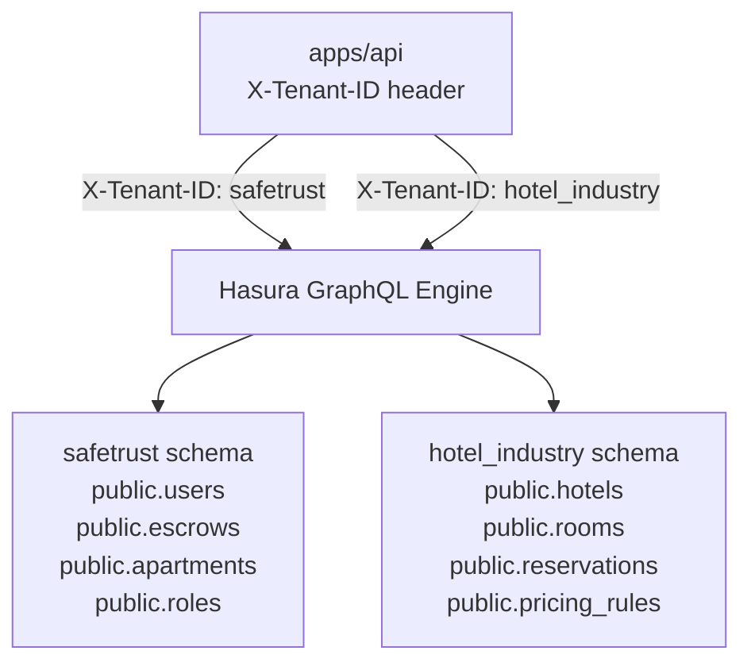

# Multi-Tenant Design

SafeTrust uses Hasura's multi-source feature to serve two tenants from a
single PostgreSQL instance. Each tenant has its own schema and metadata.

## Tenant topology



## Tenant middleware

Every request to `apps/api` passes through `tenantMiddleware` which reads
the `X-Tenant-ID` header and attaches the validated tenant to `req.tenant`:

```typescript
// Valid values
type Tenant = 'safetrust' | 'hotel_industry';

// Default when header is absent (backward compatible)
req.tenant = 'safetrust';
```

Requests with an invalid tenant value receive:
```json
{ "error": "Invalid X-Tenant-ID", "message": "Must be one of: safetrust, hotel_industry" }
```

## Metadata structure

```
infra/backend/metadata/
├── base/                   ← Shared Hasura config (actions, network, etc.)
└── tenants/
    ├── safetrust/
    │   └── databases/      ← safetrust source tables + relationships
    └── hotel_industry/
        └── databases/      ← hotel_industry source tables + relationships
```

The `bin/start` script runs `deploy-tenant.sh` for each tenant in sequence,
applying metadata and migrations. Always start both tenants together:

```bash
bin/start safetrust hotel_industry
```

Starting only `safetrust` leaves Hasura in an inconsistent metadata state
for the `hotel_industry` source.

## Handler routing by tenant

```typescript
// In any handler:
if (req.tenant === 'hotel_industry') {
  // query public.hotels, public.reservations
} else {
  // query public.apartments, public.escrows
}
```