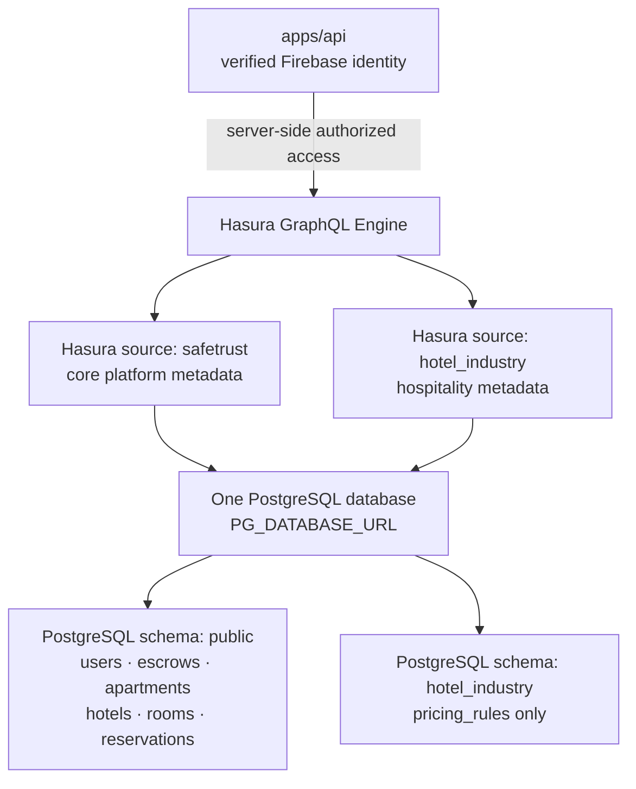

# Multi-Tenant Design

SafeTrust uses Hasura's multi-source feature to serve two tenants from a
single PostgreSQL database. `safetrust` and `hotel_industry` are Hasura source
names and tenant identifiers, not PostgreSQL schemas. Both use
`PG_DATABASE_URL`; most tables live in PostgreSQL's `public` schema, while only
`hotel_industry.pricing_rules` lives in the `hotel_industry` schema.

## Tenant topology


```mermaid
graph TD
    API["apps/api\nverified Firebase identity"]
    Hasura["Hasura GraphQL Engine"]
    ST["Hasura source: safetrust\ncore platform metadata"]
    HI["Hasura source: hotel_industry\nhospitality metadata"]
    DB["One PostgreSQL database\nPG_DATABASE_URL"]
    Public["PostgreSQL schema: public\nusers · escrows · apartments\nhotels · rooms · reservations"]
    Hotel["PostgreSQL schema: hotel_industry\npricing_rules only"]

    API -->|"server-side authorized access"| Hasura
    Hasura --> ST
    Hasura --> HI
    ST --> DB
    HI --> DB
    DB --> Public
    DB --> Hotel
```

## Verified identity and tenant resolution

The browser sends only its Firebase ID token to Hasura. The browser must never
send `x-hasura-admin-secret`, and `X-Tenant-ID` is not an authority: API
middleware ignores it and defaults to `safetrust`. The hotel source is reached
through the `hotel_industry` GraphQL fields and can be queried only when the
verified Firebase token contains an API-issued hotel role.

Hasura verifies Firebase ID tokens using the configured Firebase JWK endpoint,
issuer, and audience. The API writes these custom claims under the Firebase
claim named `hasura`:

```json
{
  "hasura": {
    "x-hasura-default-role": "MANAGER",
    "x-hasura-allowed-roles": ["MANAGER"],
    "x-hasura-user-id": "<Firebase UID>"
  }
}
```

The API-managed roles map to Hasura roles as follows: SafeTrust `guest` maps to
`tenant`, SafeTrust `host` maps to `landlord`, SafeTrust `admin` maps to
`platform_admin`, and hotel role assignments use `MANAGER` or `STAFF`. The
existing `safetrustRole` Firebase claim is retained for application behavior.
After a role change, clients must refresh their Firebase ID token to receive
the updated claims.

`MANAGER` and `STAFF` hotel selections are constrained by Hasura metadata.
Hotels filter through `owner.firebase_uid = X-Hasura-User-Id`; rooms,
reservations, and escrow records filter through their hotel relationship.
`platform_admin` has unfiltered read access. A SafeTrust-only token has no
hotel role in `x-hasura-allowed-roles`, so adding a tenant header cannot grant
hotel access.

## Metadata structure

```
infra/backend/metadata/
├── base/                   ← Shared Hasura config (actions, network, etc.)
└── tenants/
    ├── safetrust/
    │   └── databases/      ← safetrust source tables + relationships
    └── hotel_industry/
        └── databases/      ← hotel_industry source tables + relationships
```

The `bin/start` script runs `deploy-tenant.sh` for each tenant in sequence,
applying metadata and migrations. Always start both tenants together:

```bash
bin/start safetrust hotel_industry
```

Starting only `safetrust` leaves Hasura in an inconsistent metadata state
for the `hotel_industry` source.

## Server-side routing

API request middleware defaults to `safetrust`; `X-Tenant-ID` is ignored.
Server-side routes that need hotel data must authenticate the Firebase
identity and authorize its API-issued hotel role before querying that source.

Configure `FIREBASE_PROJECT_ID` in `infra/backend/.env`; Hasura uses it for
Firebase token issuer and audience verification. Hotel manager records must
have `public.hotels.owner_id` referencing the owner's `public.users.id`, with
`public.users.firebase_uid` set to the Firebase UID.
