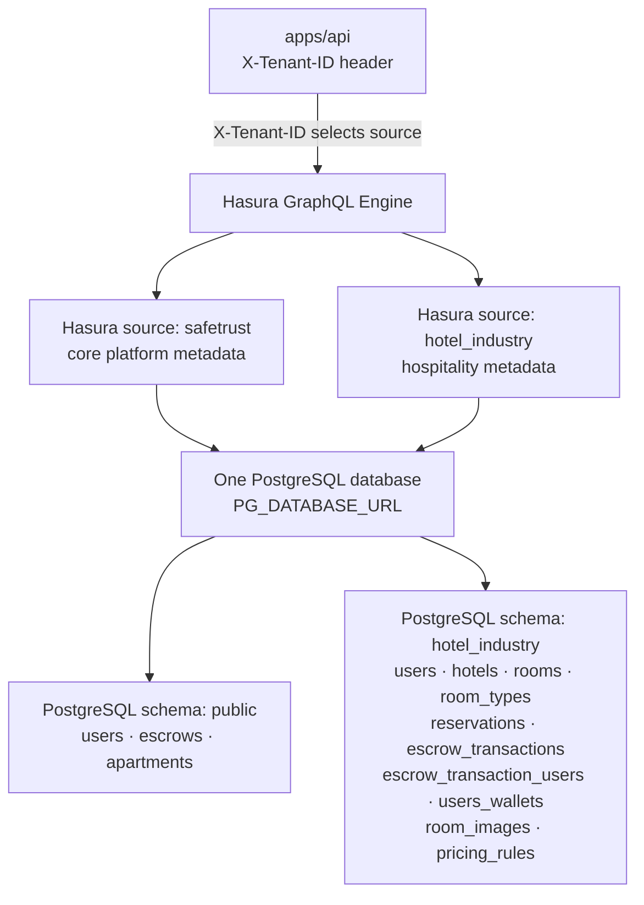

# Multi-Tenant Design

SafeTrust uses Hasura's multi-source feature to serve two tenants from a
single PostgreSQL database. `safetrust` and `hotel_industry` are both
**separate Hasura sources** and PostgreSQL schema names — the source name and
the schema it owns are the same string for each tenant. Both sources connect
to the same physical database via `PG_DATABASE_URL`; they are kept apart by
schema, not by database.

- `safetrust` source → tables live in PostgreSQL's `public` schema
  (`public.apartments`, `public.escrows`, `public.users`, ...).
- `hotel_industry` source → tables live in PostgreSQL's `hotel_industry`
  schema (`hotel_industry.hotels`, `hotel_industry.rooms`,
  `hotel_industry.reservations`, `hotel_industry.users`, ...).

There is no `public.hotels` and there is no parallel copy of any hotel table
outside `hotel_industry`. Every hotel object — tables, indexes, functions —
lives in the `hotel_industry` schema. This used to be inconsistent (hotel
migrations created bare `public.*` tables while some metadata and docs
already assumed `hotel_industry.*`); that contradiction has been resolved in
favor of `hotel_industry.*` everywhere.

## Tenant topology


```mermaid
graph TD
    API["apps/api\nX-Tenant-ID header"]
    Hasura["Hasura GraphQL Engine"]
    ST["Hasura source: safetrust\ncore platform metadata"]
    HI["Hasura source: hotel_industry\nhospitality metadata"]
    DB["One PostgreSQL database\nPG_DATABASE_URL"]
    Public["PostgreSQL schema: public\nusers · escrows · apartments"]
    Hotel["PostgreSQL schema: hotel_industry\nusers · hotels · rooms · room_types\nreservations · escrow_transactions\nescrow_transaction_users · users_wallets\nroom_images · pricing_rules"]

    API -->|"X-Tenant-ID selects source"| Hasura
    Hasura --> ST
    Hasura --> HI
    ST --> DB
    HI --> DB
    DB --> Public
    DB --> Hotel
```

## Tenant middleware

Every request to `apps/api` passes through `tenantMiddleware` which reads
the `X-Tenant-ID` header and attaches the validated tenant to `req.tenant`:

```typescript
// Valid values
type Tenant = 'safetrust' | 'hotel_industry';

// Default when header is absent (backward compatible)
req.tenant = 'safetrust';
```

Requests with an invalid tenant value receive:
```json
{ "error": "Invalid X-Tenant-ID", "message": "Must be one of: safetrust, hotel_industry" }
```

## Metadata structure

```
infra/backend/metadata/
├── base/                   ← Shared Hasura config (actions, network, etc.)
└── tenants/
    ├── safetrust/
    │   └── databases/      ← safetrust source: tables in public.*
    └── hotel_industry/
        └── databases/      ← hotel_industry source: tables + functions in hotel_industry.*
```

Each tenant directory declares exactly **one** Hasura source, named after the
tenant, and tracks only that tenant's own schema. `tenants/safetrust` never
declares a `hotel_industry` source and vice versa — declaring the same source
twice from two tenant trees is what caused the original contradiction, since
`bin/start` builds and applies each tenant's metadata independently
(`metadata/build-metadata.sh` + `metadata/deploy-tenant.sh` per tenant name).

The `bin/start` script runs migrations per tenant first, then metadata
deploy. `bin/start hotel_industry` alone completes cleanly on an empty
database — no shared or prior tenant state is required:

```bash
bin/start hotel_industry
```

Passing multiple tenants to `bin/start` (`bin/start safetrust hotel_industry`)
is a separate, pre-existing limitation and out of scope for this document:
`hasura metadata apply` fully replaces Hasura's metadata (all sources) on
every call, and each tenant's build directory only contains that tenant's
own source, so the last tenant deployed is the only one left tracked. Fixing
combined-tenant startup means changing how `metadata/build-metadata.sh` and
`metadata/deploy-tenant.sh` assemble and apply metadata, not the
hotel_industry schema itself.

## GraphQL root field names

Hasura exposes all sources under one unified GraphQL schema, so two sources
cannot both register a root field with the same name. `hotel_industry` and
`safetrust` each have their own `users` and `escrow_transactions` tables, so
the `hotel_industry` source pins explicit `custom_root_fields` on every
table it tracks (`infra/backend/metadata/tenants/hotel_industry/databases/tables/*.yaml`):

| Table (`hotel_industry.*`) | Root field | Notes |
|---|---|---|
| `hotels` | `hotels`, `hotels_by_pk`, `insert_hotels_one`, ... | unique name, kept as-is for stability |
| `rooms` | `rooms`, `rooms_by_pk`, ... | unique name |
| `room_types` | `room_types`, `room_types_by_pk`, ... | unique name |
| `reservations` | `reservations`, `reservations_by_pk`, ... | unique name |
| `users_wallets` | `users_wallets`, `users_wallets_by_pk`, ... | unique name (distinct from safetrust's `user_wallets`) |
| `room_images` | `room_images`, `room_images_by_pk`, ... | unique name |
| `pricing_rules` | `pricing_rules`, `pricing_rules_by_pk`, ... | unique name |
| `escrow_transaction_users` | `escrow_transaction_users`, ... | unique name |
| `users` | **`hotel_users`**, `hotel_users_by_pk`, `insert_hotel_users_one`, ... | prefixed — collides with `safetrust.users` |
| `escrow_transactions` | **`hotel_escrow_transactions`**, `hotel_escrow_transactions_by_pk`, ... | prefixed — collides with `safetrust.escrow_transactions` |

The `find_nearby_hotels(lat, lng, radius_meters, p_location_area)` SQL
function is tracked under
`infra/backend/metadata/tenants/hotel_industry/databases/functions/functions.yaml`
and exposed as the `find_nearby_hotels` query root field. It returns
`SETOF hotel_industry.hotels`, which is what makes it trackable by Hasura
(a function returning a native `POINT`/ad hoc `RETURNS TABLE` shape is not).

Frontend queries must use these exact root field names — see
`apps/frontend/src/graphql/queries/hotel-queries.ts`
(`hotel_escrow_transactions`, not `escrow_transactions`).

## Handler routing by tenant

```typescript
// In any handler:
if (req.tenant === 'hotel_industry') {
  // query hotel_industry.hotels and hotel_industry.reservations through the hotel_industry source
} else {
  // query public.apartments and public.escrows through the safetrust source
}
```
