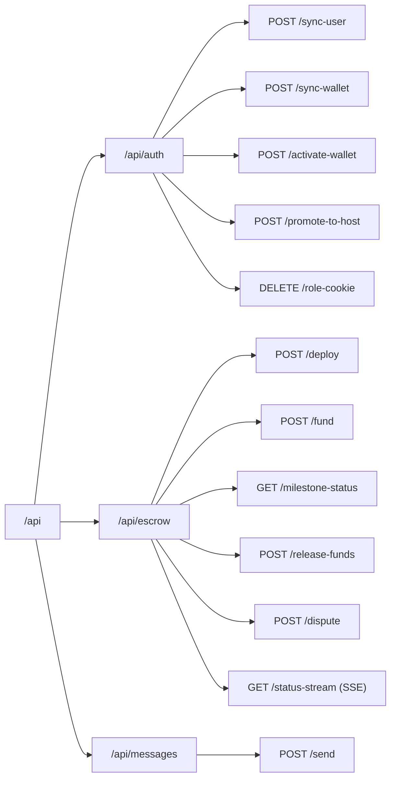

# API Routes Reference

All routes are served by `apps/api` on port 3002. Every write operation
in SafeTrust goes through this service.

## Route map



## Auth routes

| Method | Path | Auth | Description |
|---|---|---|---|
| `POST` | `/api/auth/sync-user` | Firebase token | Upsert user in `public.users` |
| `POST` | `/api/auth/sync-wallet` | Firebase token | Upsert Stellar wallet in `public.user_wallets` |
| `POST` | `/api/auth/activate-wallet` | Firebase token | Activate Pollar embedded wallet (LATAM) |
| `POST` | `/api/auth/promote-to-host` | Firebase token | Insert host role in `public.user_roles` |
| `DELETE` | `/api/auth/role-cookie` | None | Clear httpOnly role cookie (server-side) |

## Escrow routes

| Method | Path | Auth | Description |
|---|---|---|---|
| `POST` | `/api/escrow/deploy` | Firebase token | Deploy Soroban escrow, returns unsignedXDR |
| `POST` | `/api/escrow/fund` | Firebase token | Submit signed fund transaction |
| `GET` | `/api/escrow/milestone-status` | Firebase token | Get milestone status from TrustlessWork |
| `POST` | `/api/escrow/release-funds` | Firebase token | Release funds to host |
| `GET` | `/api/escrow/status-stream` | Firebase token | SSE stream for real-time escrow status |

## Middleware stack

```
Request
  │
  ├── cors()
  ├── express.json()
  ├── tenantMiddleware        ← reads X-Tenant-ID header, defaults to 'safetrust'
  ├── authenticateFirebase    ← per-route, verifies Firebase JWT
  └── route handler
```

## Health check

```
GET /health → { "status": "ok" }
```

Used by Docker Compose healthcheck and the `HasuraDownBanner` frontend component.