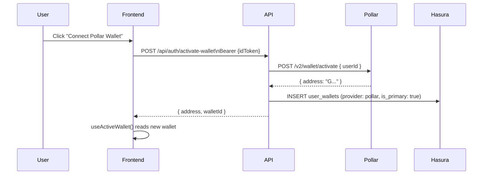

# Authentication Flow

SafeTrust uses Firebase Auth for identity and Hasura for authorization.
The middleware resolves the user's role from the database and caches it
in an httpOnly cookie.

## Registration flow

```mermaid
sequenceDiagram
    participant User
    participant Frontend
    participant Firebase
    participant API
    participant Hasura

    User->>Frontend: Fill registration form
    Frontend->>Firebase: createUserWithEmailAndPassword()
    Firebase-->>Frontend: Firebase user + idToken
    Frontend->>API: POST /api/auth/sync-user\nAuthorization: Bearer {idToken}
    API->>Firebase: getAuth().verifyIdToken(idToken)
    Firebase-->>API: { uid, email, name }
    API->>Hasura: INSERT users (ON CONFLICT update)
    API->>Hasura: GET role_id WHERE name = 'guest'
    API->>Hasura: INSERT user_roles (uid, guest_role_id)
    API-->>Frontend: { success: true, user }
    Frontend->>Frontend: router.push('/dashboard')
    Frontend->>API: middleware fetchUserRole(uid)
    API->>Hasura: GET user_roles WHERE user_id = uid
    Hasura-->>API: [{ role: { name: 'guest' } }]
    API-->>Frontend: Set-Cookie: user-role=guest; httpOnly
    Frontend->>Frontend: redirect /dashboard/guest
```

## Login flow

```mermaid
sequenceDiagram
    participant User
    participant Frontend
    participant Firebase
    participant API
    participant Middleware

    User->>Frontend: Email + password
    Frontend->>Firebase: signInWithEmailAndPassword()
    Firebase-->>Frontend: idToken
    Frontend->>API: POST /api/auth/sync-user (idempotent)
    Frontend->>Frontend: store idToken in global auth state
    Frontend->>Frontend: router.push('/dashboard')
    Middleware->>Middleware: read user-role cookie
    alt Cookie present and fresh
        Middleware->>Frontend: redirect based on cached role
    else Cookie absent or expired
        Middleware->>API: fetchUserRole(uid)
        API->>Hasura: GET user_roles
        Hasura-->>Middleware: role name
        Middleware->>Frontend: Set-Cookie: user-role=X; httpOnly
        Middleware->>Frontend: redirect to correct dashboard
    end
```

## Role cookie lifecycle

The `user-role` httpOnly cookie is written by Next.js middleware and
cannot be modified by browser JavaScript. Two server-side operations
manage it:

| Operation | Effect |
|---|---|
| Middleware on dashboard visit | Sets cookie to current DB role (1h TTL) |
| `DELETE /api/auth/role-cookie` | Clears cookie — triggers fresh DB fetch on next visit |

## Token verification

The old `services/webhook` implementation decoded Firebase JWTs manually
with `Buffer.from(token.split(".")[1], "base64url")` — no signature check.
A forged token with any chosen uid was accepted.

`apps/api` uses `getAuth().verifyIdToken(idToken)` (Firebase Admin SDK).
Forged tokens are rejected with `401 Unauthorized`.

## Pollar wallet flow (LATAM users)

Users in regions where Freighter is not available use Pollar — an embedded
Stellar wallet provisioned server-side:

