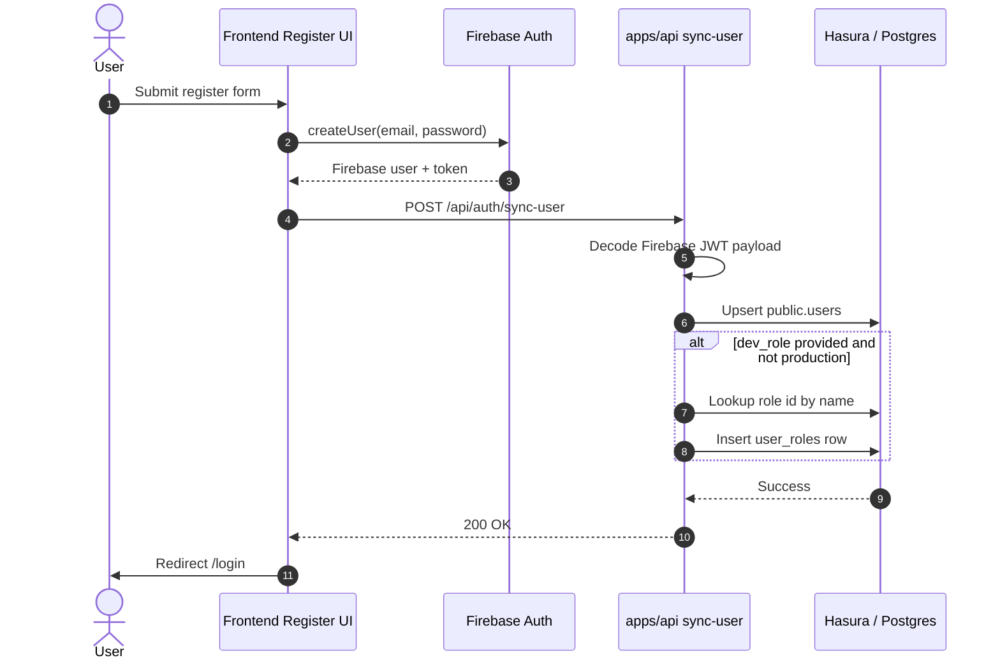
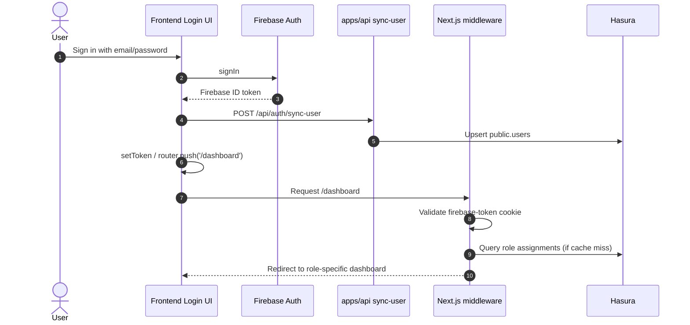
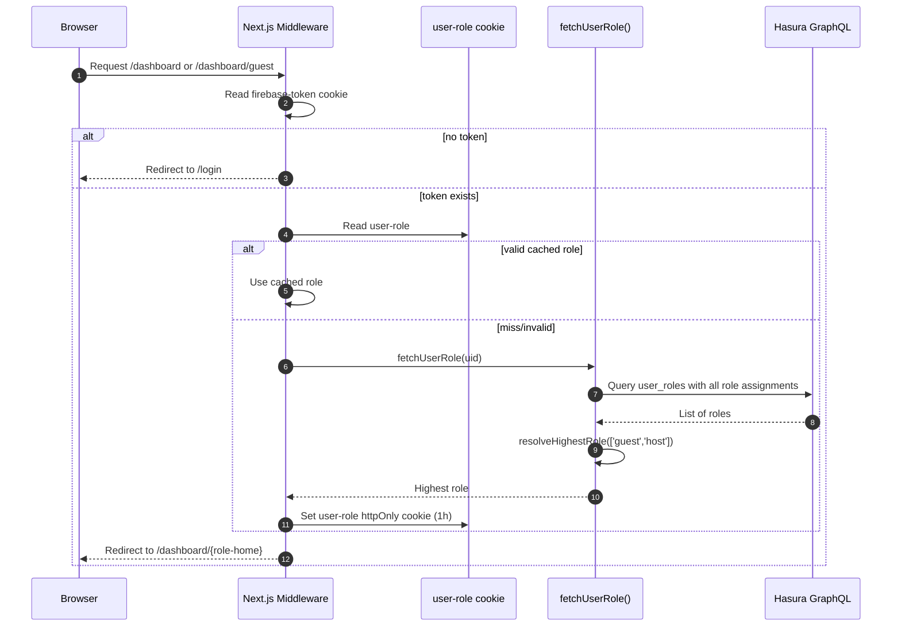

# Authentication and authorization flow

This document describes the SafeTrust authentication flow end-to-end, including Firebase JWT handling, user synchronization into Hasura, role assignment, middleware-based route gating, and the guest-to-host promotion flow.

The implementation is split across the API and the Next.js middleware:

- `apps/api/src/routes/auth/sync-user.handler.js` creates or updates the user record and can assign a dev-only role during local testing.
- `apps/api/src/routes/auth/promote-to-host.handler.ts` inserts the `host` role for a logged-in user.
- `apps/frontend/src/middleware.ts` enforces dashboard access rules and resolves the effective role.
- `apps/frontend/src/lib/middleware/fetch-user-role.ts` queries Hasura for the user's role assignments.
- `apps/frontend/src/lib/middleware/roles.ts` defines precedence and dashboard destination mapping.
- `apps/frontend/src/app/api/auth/role-cookie/route.ts` clears the cached role cookie on the server.

---

## 1. Registration flow

The registration flow begins in the frontend registration form. After Firebase creates the user, the app calls the backend sync endpoint so the user record exists in the database before the account can be used in Hasura-backed features.

### Sequence

1. User submits the Register form.
2. Firebase creates the user with email/password and returns a user object.
3. The frontend calls `POST /api/auth/sync-user` on the API server.
4. The backend reads the Firebase ID token from the `Authorization: Bearer ...` header.
5. The token is base64-decoded to recover the Firebase payload.
6. The backend upserts the row in `public.users` using `insert_users_one` with `on_conflict`.
7. The user row stores identity fields such as `id`, `email`, `first_name`, `last_name`, `phone_number`, `country_code`, and `location`.
8. In non-production environments, the request may also include `dev_role`. If present and valid (`guest` or `host`), the backend resolves that role id and inserts `user_roles` for the user.
9. The frontend redirects the user to `/login`.

### Important implementation detail

`sync-user` is intentionally designed to be idempotent. It is safe to call repeatedly after login or registration because it uses an upsert pattern for the user row.

The dev-only role assignment is a convenience for local testing. It is gated behind `NODE_ENV !== "production"` and is not meant to be used in real production flows. The safe production path is promotion through the explicit host flow.



---

## 2. Login flow

After registration, the user signs in with Firebase. The login flow syncs the user record again to guarantee that the row exists and is current before the app redirects the user to the dashboard.

### Sequence

1. User submits the login form.
2. Firebase verifies credentials and returns a refreshed Firebase user token.
3. The login page calls the backend sync endpoint again with the fresh ID token.
4. `sync-user` decodes the Firebase JWT, extracts `uid`, `email`, and user profile fields, then upserts the user record.
5. The app stores or refreshes the Firebase token in the session state.
6. The app redirects to `/dashboard`.
7. The middleware sees the protected route and resolves the user's effective role before allowing access.

The dashboard route itself is not the source of truth for authorization; it is only a routing target after the middleware has already decided whether the user is allowed and what home page to send them to.



---

## 3. Middleware role resolution

The frontend uses a Next.js middleware to protect `/dashboard/*` routes. This is the authorization gate that decides where an authenticated user is routed.

### Middleware behavior

The middleware first checks whether the request has a Firebase token cookie:

- `firebase-token`
- fallback: `auth-token`

If a user hits `/dashboard` without a token, they are redirected to `/login` with a redirect parameter.

If the user is authenticated and hits `/dashboard`, the middleware tries to resolve the current role efficiently:

1. Read `user-role` cookie.
2. If the cookie contains a known role (`guest`, `host`, `admin`), use it immediately.
3. If the cookie is missing or invalid, extract the Firebase UID from the JWT payload.
4. Call `fetchUserRole(uid)` to query Hasura for all role rows assigned to the user.
5. Resolve the highest-privilege role using precedence order.
6. Set a new `user-role` cookie with a 1-hour TTL.
7. Redirect to the correct dashboard home based on the resolved role.

### Role precedence

The important logic is in `resolveHighestRole`. The app treats the strongest role as the most permissive:

- guest = least privileged
- host = more permissive
- admin = most permissive

Since multiple rows can exist for the same user (for example, guest + host after a promotion), the middleware cannot rely on the first row returned by Hasura. It must look at all assignments and pick the highest precedence.

### Dashboard map

The middleware uses `dashboardHomeForRole(role)`:

| Role | ID | Dashboard home |
| --- | ---: | --- |
| guest | 1 | `/dashboard/guest` |
| host | 2 | `/dashboard/escrow-dashboard` |
| admin | 3 | `/dashboard/users` |

### Restriction logic

The middleware also blocks access to routes that are reserved for a different role:

- `HOST_ONLY_ROUTES`: guest users are redirected to `/dashboard/guest?blocked=true`
- `GUEST_ONLY_ROUTES`: host users are redirected to `/dashboard/escrow-dashboard`

This ensures that route access is enforced based on the resolved role, not only on login state.



---

## 4. Why the httpOnly role cookie is tricky

The role cookie is written by middleware as:

- `httpOnly: true`
- `sameSite: 'lax'`
- `path: '/'`
- `secure: process.env.NODE_ENV === 'production'`

This matters because the browser will not expose the cookie to JavaScript. In other words, this line does not work for clearing the cookie:

```js
document.cookie = 'user-role=; Max-Age=0; path=/'
```

That statement only clears a cookie that is visible to JS. The `user-role` value is stored as an `httpOnly` cookie, so the browser prevents JavaScript from reading or deleting it directly.

This is why the project includes a server endpoint:

- `apps/frontend/src/app/api/auth/role-cookie/route.ts`

The route responds to `DELETE /api/auth/role-cookie` and sends a `Set-Cookie` header with `maxAge: 0`, which tells the browser to actually remove the cookie.

This is used immediately after a promotion or any other event that changes the user's effective role, so the next dashboard navigation re-fetches the new role from Hasura instead of trusting stale cookie data.

---

## 5. Promote-to-host flow

The guest-to-host transition is a privileged action that upgrades the user's role row in Hasura and then invalidates the cached role cookie.

### Flow

1. The user clicks the “Switch to Host” button in the guest dashboard.
2. The frontend calls `currentUser.getIdToken(true)` to force a fresh token.
3. The frontend sends `POST /api/auth/promote-to-host` with the Firebase bearer token.
4. The backend ensures the user row exists in `public.users`.
5. The backend looks up the `host` role ID from the `roles` table.
6. The backend inserts `user_roles` with `user_id` + `role_id`, using `on_conflict` to avoid duplicates.
7. The frontend clears the cached role cookie via the server route.
8. The app redirects the user to `/dashboard/escrow-dashboard`.

### Why a fresh token?

Using `getIdToken(true)` forces a refresh of the Firebase ID token before promotion. This avoids stale credentials and ensures the backend receives a current identity claim from the signed-in user.

```mermaid
sequenceDiagram
    autonumber
    actor User
    participant GuestUI as Guest Dashboard
    participant Firebase as Firebase Auth
    participant API as apps/api promote-to-host
    participant Hasura as Hasura
    participant CookieRoute as /api/auth/role-cookie
    participant Browser as Browser

    User->>GuestUI: Click "Switch to Host"
    GuestUI->>Firebase: currentUser.getIdToken(true)
    Firebase-->>GuestUI: Fresh ID token
    GuestUI->>API: POST /api/auth/promote-to-host Authorization: Bearer <token>
    API->>Hasura: Ensure user exists in public.users
    API->>Hasura: Get host role id
    API->>Hasura: Insert user_roles (host)
    Hasura-->>API: success
    API-->>GuestUI: 200 { role: 'host', promoted: true }
    GuestUI->>CookieRoute: DELETE /api/auth/role-cookie
    CookieRoute-->>GuestUI: Set-Cookie: user-role=; Max-Age=0
    GuestUI->>Browser: window.location.href = '/dashboard/escrow-dashboard'
```

---

## 6. Security and contributor notes

This auth model relies on the Firebase token as the identity source and Hasura as the authorization source. The frontend never trusts only the client state to determine access. The middleware revalidates role assignments on dashboard requests and uses the cookie as a short-lived optimization layer, not as an authority.

Key principles:

- Firebase gives the user identity.
- Hasura stores the role assignments.
- Middleware reads the cookie cache first, then falls back to GraphQL.
- Role precedence is resolved server-side in the browser middleware before route access is granted.
- Cached role data is invalidated after promotion to avoid stale authorization.

This model is both performant and safe enough for the app’s dashboard gating model: the role cookie is a cache, while Hasura remains the source of truth.
