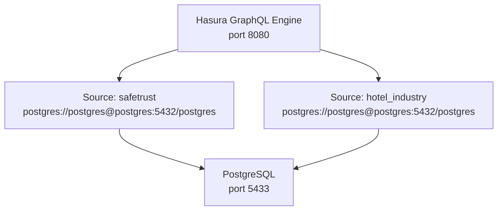

# Hasura Schema

Hasura provides the GraphQL read API and event trigger pipeline for SafeTrust.
It connects to PostgreSQL and exposes two tenant sources.

## Source configuration



Both sources connect to the same PostgreSQL instance but expose different
schema views and table permissions.

## safetrust source tables

| Table | Description |
|---|---|
| `public.users` | Registered users — id is Firebase UID (TEXT) |
| `public.user_wallets` | Stellar wallet addresses per user |
| `public.user_roles` | Many-to-many: users ↔ roles |
| `public.roles` | Role definitions: guest, host, admin |
| `public.apartments` | Rental listings owned by hosts |
| `public.escrows` | SafeTrust escrow business records |
| `public.trustless_work_escrows` | On-chain escrow mirror |
| `public.escrow_milestones` | Per-escrow milestone schedule |
| `public.trustless_work_webhook_events` | TrustlessWork event log |

## hotel_industry source tables

| Table | Description |
|---|---|
| `public.hotels` | Hotel properties |
| `public.rooms` | Rooms within hotels |
| `public.room_types` | Room category definitions |
| `public.room_images` | Room photo references |
| `public.reservations` | Booking records |
| `public.escrow_transactions` | Escrow records for hotel bookings |
| `public.escrow_transaction_users` | User associations per escrow |
| `public.pricing_rules` | Dynamic pricing rules |
| `public.user_wallets` | Tenant-scoped wallet records |

## Event triggers

Hasura sends HTTP event callbacks to `apps/api` when data changes.
The `WEBHOOK_URL` environment variable points to the API:

```
WEBHOOK_URL=http://safetrust-api:3002   # Docker Compose (internal network)
WEBHOOK_URL=http://host.docker.internal:3002  # Local pnpm dev
```

## Migrations

Migrations are managed per tenant in:

```
infra/backend/migrations/
├── safetrust/       ← safetrust schema migrations
└── hotel_industry/  ← hotel_industry schema migrations
```

Apply with:
```bash
cd infra/backend
hasura migrate apply \
  --database-name safetrust \
  --endpoint http://localhost:8080 \
  --admin-secret myadminsecretkey
```

## Metadata

```
infra/backend/metadata/
├── base/            ← Shared config (actions, network, opentelemetry)
└── tenants/
    ├── safetrust/   ← safetrust table tracking + relationships
    └── hotel_industry/  ← hotel_industry table tracking + relationships
```

The `build-metadata.sh` script merges base + tenant metadata before applying.