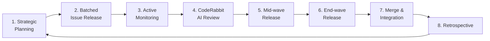

# Wave Contribution Methodology

SafeTrust uses an 8-phase contributor wave lifecycle for managing external
contributions through OnlyDust, Drips (Stellar Waves), and GrantFox.

## Wave lifecycle

## Issue scoring criteria (GrantFox)

Issues score highest when they:
- Solve an existing measured problem with before/after timing data
- Include multi-language implementations (TypeScript + tests)
- Make zero breaking changes via env var gates
- Include updated tests with clear pass/fail criteria
- Have atomic scope — one clear change per PR

Issues score poorly when they:
- Invent problems that don't exist in the codebase
- Make single-property changes (cosmetic, trivial)
- Don't include test coverage

## Curated Slice Strategy

The monorepo (`dApp-SafeTrust`) only pulls MVP-relevant components from
source repos (`frontend-SafeTrust`, `backend-SafeTrust`). Source repos
remain independent and deployable on their own.

Features solved in `dApp-SafeTrust` are ported to `frontend-SafeTrust`
via labeled GitHub issues referencing the source PR number (homologation
pattern).

## Sleeve issues

A reserve of pre-drafted issues is held back and released at strategic
points in the wave — typically mid-wave when contributor momentum peaks
and near wave-end when adrenaline-driven point-seeking is highest.

## Mermaid diagram discipline

All diagrams in SafeTrust documentation follow these rules for reliable
rendering on GitHub and GitBook:

- Maximum 2 `\n` line breaks per node label
- Maximum 1 subgraph depth
- No nested direction overrides

## Monitoring

Contributor activity is monitored via Telegram. CodeRabbit AI reviews
all PRs automatically before maintainer review.