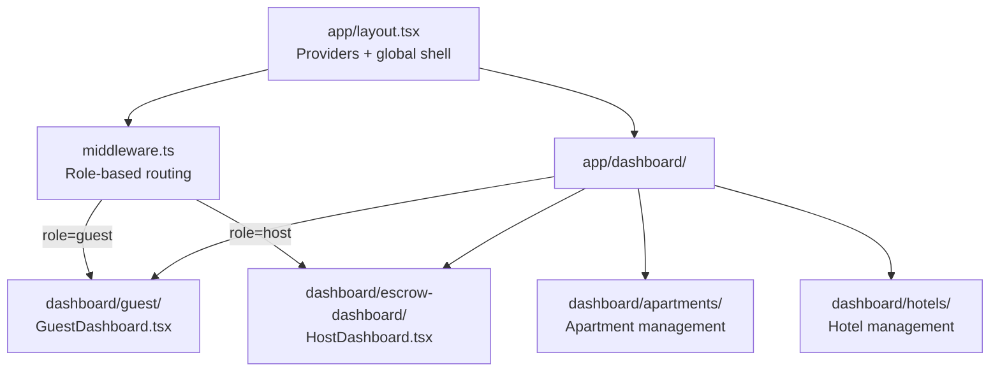

# Frontend Architecture

`apps/frontend` is a Next.js 14 App Router application. It is pure UI —
all writes go through `apps/api`, reads come from Hasura GraphQL.

## Application structure



## Middleware routing

The Next.js middleware runs on every `/dashboard*` request and routes
based on the `user-role` httpOnly cookie:

| User role | Visits | Result |
|---|---|---|
| `guest` | `/dashboard` | → `/dashboard/guest` |
| `host` | `/dashboard` | → `/dashboard/escrow-dashboard` |
| `guest` | `/dashboard/escrow-dashboard` | → `/dashboard/guest` (blocked) |
| `host` | `/dashboard/guest` | → `/dashboard/escrow-dashboard` |
| any | unauthenticated | → `/login` |

## Provider hierarchy

```tsx
<ThemeProvider>
  <ClientProviders>         ← Apollo Client, Firebase
    <PollarProvider>        ← Pollar embedded wallet SDK
      <TrustlessWorkProvider>
        {children}
        <Toaster />
      </TrustlessWorkProvider>
    </PollarProvider>
  </ClientProviders>
</ThemeProvider>
```

## Data fetching

| Pattern | Used for |
|---|---|
| Apollo Client (`useQuery`) | Apartment listings, hotel rooms, user data |
| `fetch()` direct | Auth operations via `apps/api` |
| Hasura subscriptions (`useSubscription`) | Real-time escrow status (SSE fallback) |

## Key hooks

| Hook | Purpose |
|---|---|
| `useActiveWallet()` | Returns active Stellar wallet (Freighter or Pollar) |
| `useGlobalAuthenticationStore()` | Zustand store — idToken, user state |
| `useEscrowDeploy()` | Orchestrates the deploy → sign → fund sequence |

## HasuraDownBanner

A polling component that detects when Hasura is unreachable and shows an
amber banner with the exact `bin/start` command to fix it. Polls every 30
seconds via `GET /api/health/hasura`.