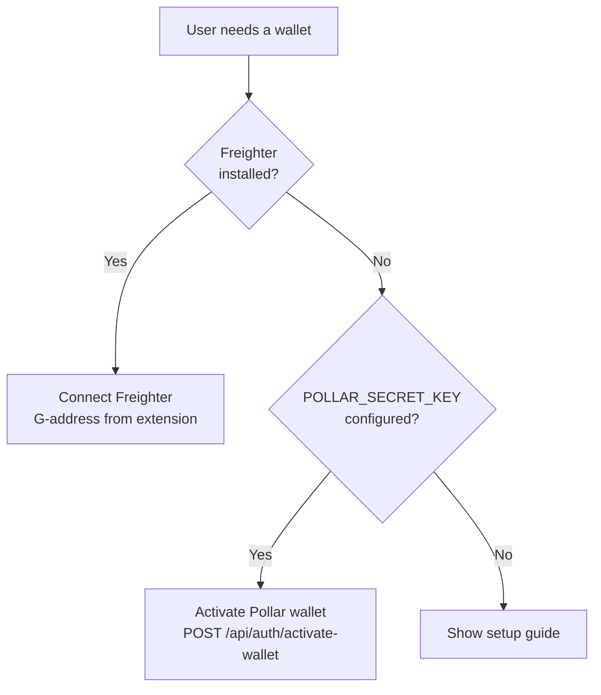
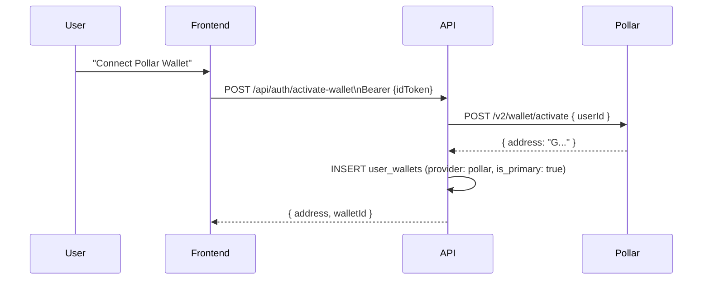

# Wallet Integration

SafeTrust supports two Stellar wallet providers: Freighter (browser
extension) for global users and Pollar (embedded) for LATAM users.

## Wallet decision flow



## Freighter integration

Freighter is a browser extension wallet for Stellar. SafeTrust uses
`@stellar/freighter-api` to request the public key and sign XDR transactions.

```typescript
// Connect
const { address } = await getAddress();

// Sign escrow transaction
const { signedTxXdr } = await signTransaction(unsignedXDR, {
  networkPassphrase: Networks.TESTNET,
});
```

After connecting, the address is synced to the DB:
```
POST /api/auth/sync-wallet
{ walletAddress, chainType: 'STELLAR', isPrimary: true, provider: 'freighter' }
```

## Pollar integration

Pollar provisions an embedded Stellar wallet server-side for users who
cannot install browser extensions (mobile, restricted environments).



`PollarProvider` must be present in `app/layout.tsx` for `usePollar()` to
work in the `useActiveWallet()` hook.

## useActiveWallet hook

The `useActiveWallet()` hook abstracts the wallet provider choice:

```typescript
const { address, signTransaction, provider } = useActiveWallet();
// address: G... (from whichever provider is active)
// provider: 'freighter' | 'pollar'
// signTransaction: (xdr: string) => Promise<string>
```

The `is_primary` flag in `public.user_wallets` determines which wallet
is the active signer for escrow transactions. A partial unique index enforces
at most one primary wallet per user. Both wallet upsert paths demote the user's
current primary and promote the selected wallet in one Hasura mutation, so the
change is atomic.

## Wallet address storage

```sql
-- user_wallets schema
id             uuid PRIMARY KEY
user_id        text REFERENCES users(id)
wallet_address text UNIQUE
chain_type     text  -- always 'STELLAR'
is_primary     bool
provider       text  -- 'freighter' | 'pollar' | 'albedo'

UNIQUE (user_id) WHERE is_primary IS TRUE
```

Upsert uses `ON CONFLICT (wallet_address) DO UPDATE SET is_primary, provider`
— connecting the same wallet twice is idempotent. Queries that select an
escrow signer order primary wallets by `updated_at DESC, id ASC` before applying
`limit: 1` for deterministic behavior.
