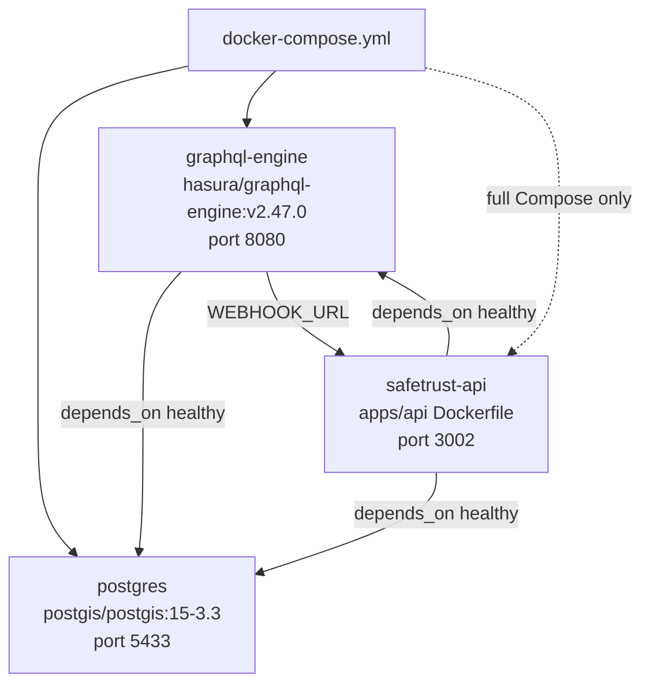

# Docker Compose

SafeTrust's backend infrastructure runs three containers managed by
`infra/backend/docker-compose.yml`.

## Container topology



## Services

### postgres
- Image: `postgis/postgis:15-3.3` — PostGIS extension for geospatial hotel queries
- Port: `5433:5432` (host:container)
- Health: `pg_isready -U postgres`
- Data: `db_data` named volume

### graphql-engine (Hasura)
- Image: `hasura/graphql-engine:v2.47.0`
- Port: `8080:8080`
- `WEBHOOK_URL` is configurable; local development defaults to
  `http://host.docker.internal:3002`
- `host.docker.internal:host-gateway` maps the host on native Linux
- `HASURA_ADMIN_SECRET=myadminsecretkey` (dev only)

### api (apps/api)
- Built from `../../apps/api/Dockerfile` (Node 20 Alpine)
- Port: `3002:3002`
- Replaces the archived `services/webhook` process (Compute Resource Consolidation)

## Local dev vs Docker Compose

In local `pnpm dev`, `apps/api` runs as a Turborepo process on port 3002 —
`bin/start` starts only `postgres` and `graphql-engine`, leaving port 3002 to
that process. Hasura must still reach `apps/api` for event triggers. Set in
`infra/backend/.env`:

```dotenv
# For local pnpm dev — Hasura (Docker) calls host machine
WEBHOOK_URL=http://host.docker.internal:3002
```

To run all three services in Compose, explicitly select the internal API
hostname:

```bash
cd infra/backend
WEBHOOK_URL=http://safetrust-api:3002 docker compose up -d
```

## Docker Engine CE migration

SafeTrust migrated from Docker Desktop to Docker Engine CE to eliminate
QEMU-based OOM crashes under load.

### Migration steps (Ubuntu/Debian)

```bash
# Remove Docker Desktop
sudo apt remove docker-desktop

# Add the repository for the detected Ubuntu or Debian release
sudo apt update
sudo apt install ca-certificates curl
. /etc/os-release
case "$ID" in
  ubuntu|debian) docker_distribution="$ID" ;;
  *) echo "Unsupported distribution: $ID" >&2; exit 1 ;;
esac
sudo install -m 0755 -d /etc/apt/keyrings
sudo curl -fsSL "https://download.docker.com/linux/${docker_distribution}/gpg" \
  -o /etc/apt/keyrings/docker.asc
sudo chmod a+r /etc/apt/keyrings/docker.asc
echo "deb [arch=$(dpkg --print-architecture) signed-by=/etc/apt/keyrings/docker.asc] \
  https://download.docker.com/linux/${docker_distribution} ${VERSION_CODENAME} stable" \
  | sudo tee /etc/apt/sources.list.d/docker.list

# Install
sudo apt update && sudo apt install docker-ce docker-ce-cli containerd.io jq

# Back up the Docker CLI config, then remove only Docker Desktop's broken helper
if [ -f "$HOME/.docker/config.json" ]; then
  cp -p "$HOME/.docker/config.json" "$HOME/.docker/config.json.bak"
  docker_config_tmp="$(mktemp)"
  jq 'if .credsStore == "desktop" then del(.credsStore) else . end' \
    "$HOME/.docker/config.json" > "$docker_config_tmp"
  chmod --reference="$HOME/.docker/config.json" "$docker_config_tmp"
  mv "$docker_config_tmp" "$HOME/.docker/config.json"
fi

# Use default context
docker context use default

# Add user to docker group (permanent — log out and back in)
sudo usermod -aG docker $USER
```

## Useful commands

```bash
# Start PostgreSQL and Hasura for local development (run pnpm dev separately)
cd infra/backend && bin/start safetrust hotel_industry

# Start the full Compose stack, including the API container
WEBHOOK_URL=http://safetrust-api:3002 docker compose up -d

# Stop and remove volumes (full reset)
docker compose down -v

# View running containers
docker ps

# View Hasura logs
docker compose logs graphql-engine -f

# Access Hasura console
hasura console \
  --endpoint http://localhost:8080 \
  --admin-secret myadminsecretkey
```
