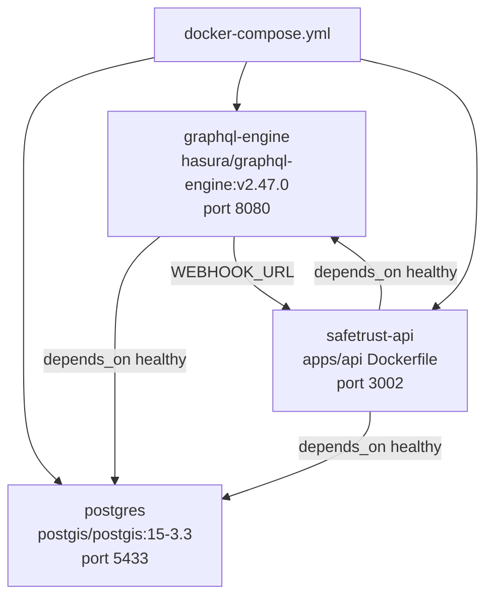

# Docker Compose

SafeTrust's backend infrastructure runs three containers managed by
`infra/backend/docker-compose.yml`.

## Container topology



## Services

### postgres
- Image: `postgis/postgis:15-3.3` — PostGIS extension for geospatial hotel queries
- Port: `5433:5432` (host:container)
- Health: `pg_isready -U postgres`
- Data: `db_data` named volume

### graphql-engine (Hasura)
- Image: `hasura/graphql-engine:v2.47.0`
- Port: `8080:8080`
- `WEBHOOK_URL=http://safetrust-api:3002` — internal Docker network hostname
- `HASURA_ADMIN_SECRET=myadminsecretkey` (dev only)

### api (apps/api)
- Built from `../../apps/api/Dockerfile` (Node 20 Alpine)
- Port: `3002:3002`
- Replaces the archived `services/webhook` process (Compute Resource Consolidation)

## Local dev vs Docker Compose

In local `pnpm dev`, `apps/api` runs as a Turborepo process on port 3002 —
the Docker `api` container is not started. Hasura must still reach `apps/api`
for event triggers. Set in `infra/backend/.env`:

```dotenv
# For local pnpm dev — Hasura (Docker) calls host machine
WEBHOOK_URL=http://host.docker.internal:3002

# For full Docker Compose — internal network hostname
WEBHOOK_URL=http://safetrust-api:3002
```

## Docker Engine CE migration

SafeTrust migrated from Docker Desktop to Docker Engine CE to eliminate
QEMU-based OOM crashes under load.

### Migration steps (Ubuntu/Debian)

```bash
# Remove Docker Desktop
sudo apt remove docker-desktop

# Add Docker Engine CE repository (use Ubuntu codename, not distro)
echo "deb [arch=amd64 signed-by=/usr/share/keyrings/docker.gpg] \
  https://download.docker.com/linux/ubuntu noble stable" \
  | sudo tee /etc/apt/sources.list.d/docker.list

# Install
sudo apt update && sudo apt install docker-ce docker-ce-cli containerd.io

# Fix credential helper (Docker Desktop leaves a broken config)
echo '{"auths": {}}' > ~/.docker/config.json

# Use default context
docker context use default

# Add user to docker group (permanent — log out and back in)
sudo usermod -aG docker $USER
```

## Useful commands

```bash
# Start all infrastructure
cd infra/backend && bin/start safetrust hotel_industry

# Stop and remove volumes (full reset)
docker compose down -v

# View running containers
docker ps

# View Hasura logs
docker compose logs graphql-engine -f

# Access Hasura console
hasura console \
  --endpoint http://localhost:8080 \
  --admin-secret myadminsecretkey
```