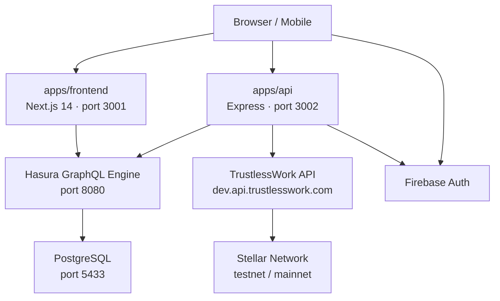

# System Overview

SafeTrust is a decentralized P2P escrow platform built on the Stellar
blockchain. It targets the hospitality and rental sector — hotels, vacation
rentals, and short-term bookings — replacing wire transfers and credit card
holds with on-chain Soroban smart contract escrows.

## High-level architecture



## Monorepo layout

```
dApp-SafeTrust/             ← Turborepo monorepo
├── apps/
│   ├── api/                ← Express write authority (port 3002)
│   ├── frontend/           ← Next.js UI (port 3001)
│   └── mcp/                ← SafeTrust MCP server
├── infra/
│   └── backend/            ← Hasura + PostgreSQL (Docker Compose)
├── packages/
│   ├── graphql/            ← Shared GraphQL types
│   └── types/              ← Shared TypeScript types
└── docs/                   ← This documentation
```

## Responsibility boundaries

| Layer | Responsibility | Port |
|---|---|---|
| `apps/frontend` | UI only — reads via Hasura GraphQL | 3001 |
| `apps/api` | All writes — auth sync, escrow deploy, fund, release | 3002 |
| `Hasura` | GraphQL read API + event triggers → apps/api | 8080 |
| `PostgreSQL` | Two schemas: `safetrust` and `hotel_industry` | 5433 |
| `TrustlessWork` | Soroban escrow deployment and lifecycle on Stellar | external |

## Compute Resource Consolidation pattern

`apps/api` replaced `services/webhook` as the single write authority.
Two Express processes that were always co-deployed and co-scaled were merged
into one. Re-separate only when TrustlessWork ships a real webhook indexer
or throughput requires independent horizontal scaling.

Reference: [Microsoft Azure — Compute Resource Consolidation](https://learn.microsoft.com/en-us/azure/architecture/patterns/compute-resource-consolidation)