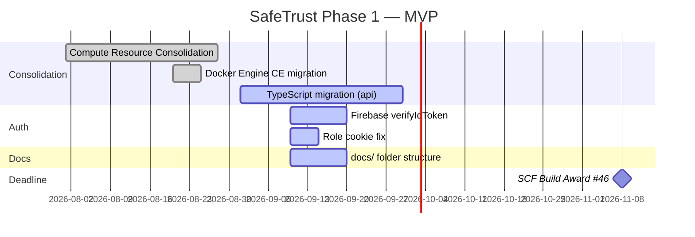

# Milestones

SafeTrust development is organized into three phases aligned with the
SCF Build Award #46 deadline of November 8, 2026.

## Phase 1 — MVP (current)

### Phase 1 deliverables

| Feature | Status |
|---|---|
| Firebase Auth + role-based routing | ✅ done |
| Escrow deploy / fund / release | ✅ done |
| Multi-tenant (safetrust + hotel_industry) | ✅ done |
| Compute Resource Consolidation | ✅ done |
| Idempotency service | ✅ done |
| Tenant middleware | ✅ done |
| TypeScript migration (sync-user, activate-wallet) | 🔄 in progress |
| docs/ folder (SCF requirement) | 🔄 in progress |
| Pollar embedded wallet | 🔄 in progress |
| x402 protocol | ⏳ Phase 2 |

## Phase 2 — Agentic payments

- x402 HTTP 402 payment protocol for autonomous AI agent bookings
- AI concierge — per-request micropayments for room search and booking
- Metered API access for third-party integrations

## Phase 3 — Human-in-loop AI

- AI approval workflows for high-value bookings
- Human-in-loop escrow release for disputed transactions
- AI System Architecture consulting positioning

## Open issues by priority

| Issue | Description | Priority |
|---|---|---|
| #307 | Merge services/webhook → apps/api (PR) | 🔴 high |
| #308 | Move Next.js escrow routes → apps/api | 🔴 high |
| #359 | sync-user TypeScript migration | 🟡 medium |
| #360 | activate-wallet TypeScript migration | 🟡 medium |
| #363 | DELETE /api/auth/role-cookie | 🟡 medium |
| #310 | Pollar backend integration | 🟡 medium |
| #316 | Pollar frontend components | 🟡 medium |
| #368–374 | docs/ folder (7 issues) | 🟢 docs |