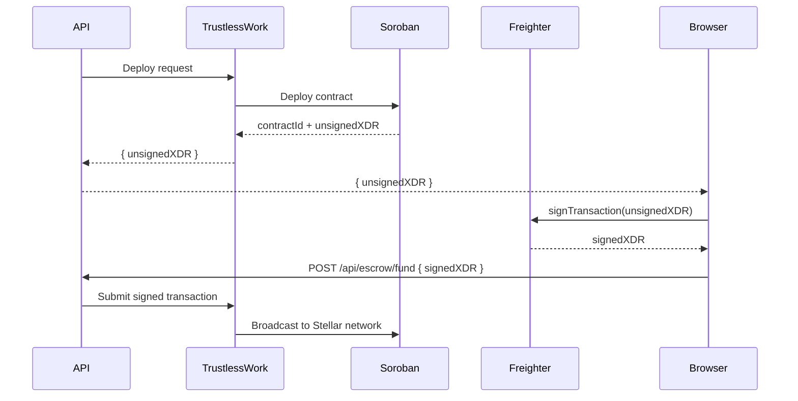

# Soroban Smart Contracts

SafeTrust uses Soroban (Stellar's smart contract platform) through the
TrustlessWork abstraction layer. Direct Soroban interaction is limited to
XDR signing in the browser via Freighter or Pollar.

## Contract flow



## ZK privacy layer

SafeTrust has a zero-knowledge privacy layer in the `safetrust-ZK` repo.
Three Noir circuits handle privacy-preserving operations:

```
safetrust-ZK/
├── proof_of_funds.nr      ← Prove sufficient balance without revealing amount
├── private_escrow.nr      ← Hide escrow amount from public ledger
└── milestone_release.nr   ← ZK proof for milestone completion
```

The ZK layer uses the UltraHonk proving system on the BN254 curve.
It integrates into `backend-SafeTrust` via a `ZK_ENABLED` environment
variable gate — existing behavior is unaffected when `ZK_ENABLED=false`.

### View key pattern

Amounts are hidden in ZK proofs. Hosts retain a **view key** to audit
their own escrow amounts without exposing them on the public ledger.
This resolves the tension between privacy and auditability in hospitality
business logic.

## Network configuration

SafeTrust currently operates on **Stellar testnet** (`dev.api.trustlesswork.com`).
Mainnet migration requires:
- Updating `TRUSTLESS_WORK_API_URL` to the production endpoint
- Updating the USDC issuer address to the mainnet value
- Completing security audit of the Soroban contract roles configuration