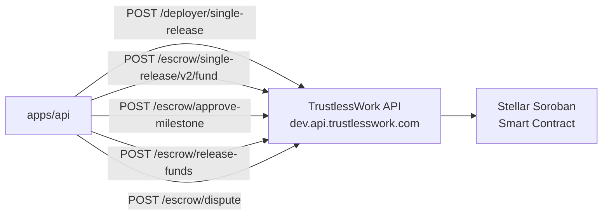

# TrustlessWork API

TrustlessWork provides the Soroban smart contract infrastructure for
SafeTrust escrows. SafeTrust calls TrustlessWork to deploy, fund,
approve milestones, and release funds — without managing Soroban contracts
directly.

## Integration points



## Endpoints used

| Endpoint | Called by | Purpose |
|---|---|---|
| `POST /deployer/single-release` | `deploy.handler.ts` | Deploy escrow contract, returns unsignedXDR |
| `POST /escrow/single-release/v2/fund` | `fund.handler.ts` | Build and return an unsigned fund transaction |
| `POST /escrow/approve-milestone` | `approve-milestone.handler.ts` | Guest approves milestone |
| `POST /escrow/release-funds` | `release-funds.handler.ts` | Release funds to host |
| `POST /escrow/dispute` | `dispute.handler.ts` | Open a dispute |
| `POST /escrow/resolve-dispute` | `resolve-dispute.handler.ts` | Resolve dispute |

## Authentication

All TrustlessWork requests use a Bearer token:

```typescript
headers: {
  'Authorization': `Bearer ${process.env.TRUSTLESS_WORK_API_KEY}`,
}
```

The API key is stored in `apps/api/.env` as `TRUSTLESS_WORK_API_KEY`.
Never expose this key in the frontend bundle.

## Deploy payload structure

```typescript
{
  engagementId: string,       // SafeTrust business identifier
  title: string,              // e.g. "SafeTrust Rental — APT001"
  signer: string,             // guest G-address
  amount: number,             // numeric amount expected by the deploy endpoint
  roles: {
    approver: string,         // guest G-address
    serviceProvider: string,  // host G-address
    receiver: string,         // host G-address
    releaseSigner: string,    // guest G-address
    disputeResolver: string,  // platform G-address
    platformAddress: string,  // platform treasury G-address
  },
  payment: {
    asset: { code: 'USDC', issuer: string },
    amount: string,           // string — Stellar requires string amounts
  }
}
```

## USDC asset addresses

| Network | Issuer |
|---|---|
| Testnet | `GBBD47IF6LWK7P7MDEVSCWR2JQTMZ35MIFUQ5IQSQ9CQBZ8JMXKDPE` |
| Mainnet | `GA5ZSEJYB37JRC5AVCIA5MOP4RHTM335X2KGX3IHOJAPP5RE34K4KZVN` |

## Error handling

TrustlessWork errors are wrapped by `trustlessWorkRequest` in
`apps/api/src/services/trustlesswork.ts`. The service throws
`TrustlessWorkRequestError` with `statusCode`, `messages`, and `payload`
for structured error handling in route handlers.
