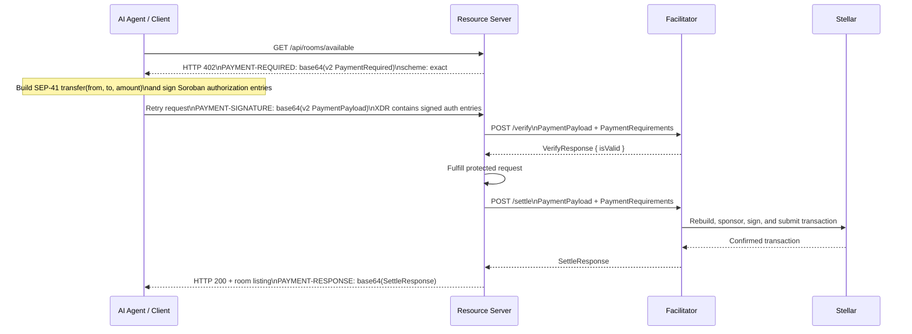

# x402 Agentic Payments

x402 is an HTTP 402 payment protocol with a Stellar binding. It enables
autonomous AI agents to authorize on-chain API payments. SafeTrust's proposed
integration is an incomplete Phase 2 roadmap note, not an implemented contract.

## Concept



Phase 2 has not selected `stellar:testnet` or `stellar:pubnet`. The current v2
Stellar `exact` scheme uses facilitator-sponsored fees
(`extra.areFeesSponsored: true`), but SafeTrust has not selected a facilitator
or the operating fee/funding model.

## SafeTrust x402 use cases

| Use case | Payment trigger | Amount |
|---|---|---|
| Search available rooms | Per search query | micropayment |
| Reserve a room | Per booking attempt | full escrow deposit |
| AI concierge session | Per conversation turn | micropayment |
| Analytics API access | Per data pull | metered |

## Implementation status

x402 integration is an **incomplete Phase 2 roadmap item**. The current MVP
(Phase 1) uses standard Firebase Auth Bearer tokens for all API access; no x402
runtime contract is implemented.

The `Metered/x402` payment layer was prototyped in the
`OFFER-HUB` freelance marketplace project for Stellar Hacks 2026
and will be ported to SafeTrust post-MVP.

The facilitator, MCP request flow, Stellar network, fee model, and deployment
configuration remain unspecified. They must be designed and approved before
the placeholders below can become a supported configuration contract.

## Environment variables (Phase 2)

```dotenv
# Illustrative placeholders only — incomplete and not supported configuration
X402_ENABLED=true
X402_RECEIVER_ADDRESS=G...         # SafeTrust payment receiver
X402_PRICE_PER_SEARCH=0.01        # USDC
X402_PRICE_PER_BOOKING=0.10       # USDC
```
