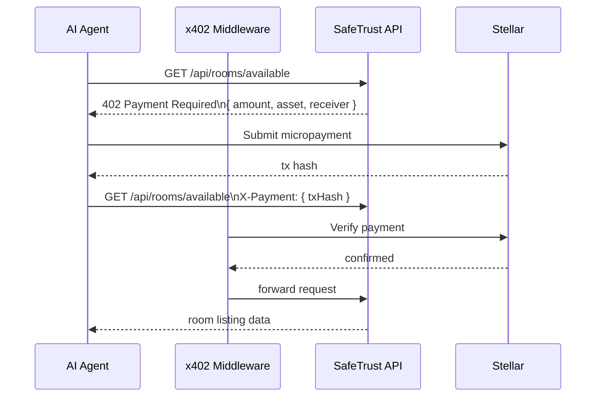

# x402 Agentic Payments

x402 is the Stellar HTTP 402 payment protocol. It enables autonomous AI
agents to pay for API requests with on-chain micropayments — no user
interaction required. SafeTrust's Phase 2 roadmap integrates x402 for
AI-driven autonomous bookings.

## Concept



## SafeTrust x402 use cases

| Use case | Payment trigger | Amount |
|---|---|---|
| Search available rooms | Per search query | micropayment |
| Reserve a room | Per booking attempt | full escrow deposit |
| AI concierge session | Per conversation turn | micropayment |
| Analytics API access | Per data pull | metered |

## Implementation status

x402 integration is a **Phase 2** feature. The current MVP (Phase 1)
uses standard Firebase Auth Bearer tokens for all API access.

The `Metered/x402` payment layer was prototyped in the
`OFFER-HUB` freelance marketplace project for Stellar Hacks 2026
and will be ported to SafeTrust post-MVP.

## Environment variables (Phase 2)

```dotenv
X402_ENABLED=true
X402_RECEIVER_ADDRESS=G...         # SafeTrust payment receiver
X402_PRICE_PER_SEARCH=0.01        # USDC
X402_PRICE_PER_BOOKING=0.10       # USDC
```